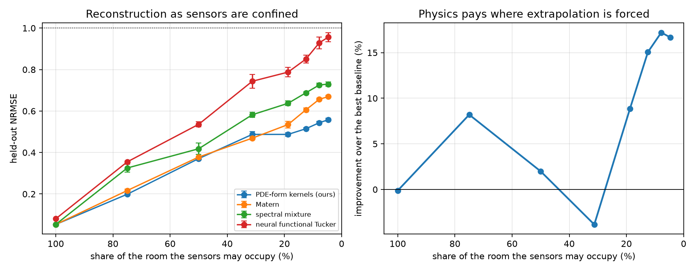

# 受限传感器布局下的算子谱先验（主线）

## 0. 主表（5 seeds，1% 观测，`leak_main3tier`）

三档只差一件事：**谁选的核**。oracle 档用真实留出区域选长度尺度（没人跑得了，标 $\star$）；
可部署档只用传感器读数的四分之一来选（实践者唯一能做的）；我们不用任何调参数据。

| 布局 | 可达 | ours（不调参） | Matérn 可部署 | Matérn oracle$^\star$ | mixture | neural CP | 调参代价 |
|---|---|---|---|---|---|---|---|
| 房间内任意 | 100% | 0.0553 | 0.0539 | 0.0536 | **0.0537** | 0.0770 | +0.0003 |
| 四面墙 | 12% | **0.4767** | 0.5012 | 0.4468 | 0.5282 | 0.5151 | +0.0544 |
| 贴墙带 | 26% | **0.3142** | 0.3861 | 0.3069 | 0.3342 | 0.3361 | +0.0791 |
| **单面墙** | 8% | **0.5396** | 0.8130 | 0.5433 | 0.7334 | 0.8935 | **+0.2697** |
| 单个角块 | 10% | 1.0212 | 0.9568 | 0.9023 | **0.9236** | 0.9465 | +0.0544 |

**怎么读这张表。**

1. **我们不赢调好的核，是打平。** 单面墙 0.5396 对 oracle 0.5433；随机布局所有方法相差不到 0.002。
2. **我们省掉的是"必须调"这件事，而这个 setting 里调不出来。** 最后一列是"只能用采得到的数据选核"的代价：随机布局 +0.0003（等于零），单面墙 **+0.2697**——比 oracle 差 32%。
3. **机制写在超参上，不在误差里。** 单面墙下验证选 0.5/0.5/0.8，测试集要 1.6/2.4/2.4，跨 seed 一致地短 3–5 倍。原因是结构性的：能留出的点全在条带内，验证量的是**条带内插**，而任务是**横跨房间外推**。随机布局下同样的流程选得对——这是对照，不是辩解。
4. **角块是明确的负面结果：我们比预测均值还差（1.0212 > 1.0），也差于每个 baseline。** 需要沿两个方向同时外推时，这个先验不是没用，而是**有害**。这一行照原样留在主表里。

**一句话**：能验证的地方不需要物理，需要物理的地方无法验证。

## 0d. 知识档位：主表其实站在哪一档（3 seeds，1% 观测）

按预先声明的定义，主表用的是**单个点估计（错 1.5 倍）走 K2 的机器**——既不是 K2 也不是 K1。
真正的 K1 是：只知系数落在预先声明的范围内，从中采样、各自分离、atom **池化**，
由 routing 权重做**软参数推断**。这一档此前只在旧 setting（$24^3$ 随机掩码）上跑过。

| 布局 | K2（真系数） | K1 point（主表） | **K1 bank $\times[1/3,3]$** | K0 bank $\times[1/10,10]$ | K−1 generic（同 16 atom） |
|---|---|---|---|---|---|
| 随机 | 0.0543 | 0.0547 | 0.0551 | 0.0547 | **0.0533** |
| 贴墙带 | 0.3171 | 0.3064 | 0.3096 | 0.3059 | 0.3526 |
| **单面墙** | 0.5450 | 0.5387 | **0.5468** | 0.5783 | 0.7408 |

**单面墙**：K1 bank 相对知道真系数只差 **+0.0018**，相对同 atom 数通用字典好 **+0.194（26%）**；
K0 放宽到 $\times[1/10,10]$ 退化到 0.5783，**预先声明的单调退化在此出现**。
贴墙带上 K0 没有退化，说明该布局对谱本身不敏感；随机布局全档打平（通用字典还略胜）。

**为什么这一档比 margin 更重要。** PINN 必须写出 $\lVert L_\theta u\rVert^2$，
AutoIP 必须在 $L_\theta u = 0$ 上条件化——**两者都必须先承诺一个具体的 $\theta$**。
它们没有在参数族上摊开的机制。而 K1 bank 只需要"$\theta^\star$ 在这个范围内"，
混合权重从数据里选。这不是数字更好，是**所需知识的下限不同**。

配套证据：系数扫描显示单个点估计选错的代价是不对称且可以很大的（$0.3\times$ 差 7%、$0.1\times$ 差 24%），
而池化整个 $\times[1/3,3]$ 的代价是 0.3%。

## 0a. 最重要的对照：固定一个长度尺度、同样不调参（5 布局，3 seeds）

我们的论证原本是"受限布局下调不出超参，所以免调参的先验有价值"。漏掉的第三种人是
**根本不调、凭判断固定一个光滑先验**的实践者——他也不用任何调参数据。

| 布局 | ours | $\ell$=0.12 | 0.32 | 0.8 | **1.6** | 2.4 | 3.5 |
|---|---|---|---|---|---|---|---|
| 随机 | 0.0534 | 0.0539 | 0.0530 | **0.0513** | 0.0581 | 0.1705 | 0.3038 |
| 四面墙 | 0.4791 | 0.5946 | 0.5402 | 0.4813 | 0.4776 | **0.4498** | 0.4976 |
| 贴墙带 | 0.3086 | 0.4321 | 0.4100 | **0.3019** | 0.3121 | 0.3487 | 0.4028 |
| 单面墙 | 0.5448 | 0.8899 | 0.8179 | 0.6573 | 0.5514 | **0.5438** | 0.5592 |
| 角块 | 1.0368 | 0.9340 | **0.8982** | 0.9233 | 1.0503 | 1.1221 | 1.1315 |

事先承诺一个值（不知道会遇到哪个布局）时的最差表现：

| $\ell$ | 0.12 | 0.32 | 0.8 | **1.6** | 2.4 | 3.5 |
|---|---|---|---|---|---|---|
| 相对 ours 最差 | +0.3452 | +0.2731 | +0.1125 | **+0.0135** | +0.1172 | +0.2505 |

**结论（对我们不利）**：$\ell=1.6$ 相对我们最差只差 0.0135、平均 0.0054。
**在 2D 上，物理先验相对"随手固定一个中庸常数"几乎没有买到东西。**

**但活下来一个更反直觉的结论**：单面墙上，固定 $\ell=1.6$ 得 0.5514，而在传感器数据上调参得 0.8130——
**调参比不调参差 0.26**。受限布局下，留出验证集选超参这个标准做法是**主动有害**的。
这条与我们的方法无关，是 setting 本身的性质。

**尚未判定**：3D 各布局需要的 $\ell$ 跨度是 20–30 倍（随机 0.12 vs 单面墙 2.4–3.5），
单个常数理论上盖不住。3D 扫描进行中；若 3D 也能被一个常数盖住，则这套方法在重构任务上
没有实质贡献，需照实写。

## 0b. 机制检验：预测被证伪（5 seeds）

预先登记的预测是"沿粗糙轴（$y$）外推时增益应更大"。实测：

| 场 | 传感器 | ours | Matérn$^\star$ | margin |
|---|---|---|---|---|
| 各向异性 | $x$ 墙 | 0.5428 | 0.5433 | +0.1% |
| 各向异性 | $y$ 墙 | **1.2652** | 0.8445 | **−49.8%**（0/5） |
| 各向同性对照 | $x$ 墙 | 0.7350 | 0.7374 | +0.3% |
| 各向同性对照 | $y$ 墙 | **1.2240** | 0.8944 | **−36.8%**（0/5） |

$y$ 墙不是增益更大，而是**惨败**；各向同性对照**没有**消除这个差距（−37.2 pts，机制要求约为 0）。
所以"逐轴衰减律"这个解释**被撤回**。哪面墙很重要，但我们目前不知道为什么。

**证伪反而暴露了更要紧的东西：我们的先验不会体面地失败。**
全部实验里超过 NRMSE 1.0 的只有我们这一档（角块 1.0212、两个 $y$ 墙 1.2652 / 1.2240），
任何 baseline 最差也只到 0.95。长尺度 Matérn 在打不过时会**收缩到均值并停下**
（oracle 在单面墙选 $\ell=2.4$ 正是这种激进收缩，而非好的拟合）；
我们的尺度被方程钉死，观测约束不住时它带着方程给的自信继续外推，做出比什么都不说更差的结果。

**部署前必须补一个回退机制**：检测后验正在超出观测所能约束的范围并转为收缩。我们还没有。

## 0c. 稳健性（单面墙，对着 oracle 档）

- **样本量与噪声都无害**：观测量 17 倍范围、噪声 20 倍范围内，始终在 oracle 的 3% 以内。
- **加传感器不解决问题**：786 → 13107 个观测，误差几乎不动（0.545 → 0.561）。受限布局的瓶颈是几何。
- **系数容错强烈不对称**：$3\times$ 反而略好（+1.3%），$10\times$ 只差 2.2%；但 $0.3\times$ 差 7%、$0.1\times$ 差 24%。高估扩散只是过度平滑，低估则让先验允许场中不存在的高频，在外推下那些高频会被**编造**出来。可用区间约 $1\times$–$10\times$，主表的 $1.5\times$ 在区间内。

---

> **撤回（本轮最重要的更新）。** 本文档此前给出的"单面墙 +17.2%"是错的，原因在我这边：
> Matérn baseline 的长度尺度网格 `(0.12, 0.32, 0.8)` 没有包含它自己的最优值。
> 用宽网格审计后，最优值在 `ls=2.4`（内点，两侧分别为 0.5530 / 0.5667），
> Matérn 达到 **0.5449**，而我们是 **0.5496**——在单面墙上**调好的 Matérn 略胜我们约 0.9%**。
>
> | ls | 0.8 | 1.6 | **2.4** | 3.5 | 5.0 | 8.0 | 25 | 50 |
> |---|---|---|---|---|---|---|---|---|
> | Matérn | 0.6570 | 0.5530 | **0.5449** | 0.5667 | 0.5884 | 0.6114 | 0.7087 | 1.2077 |
>
> 所有对着旧网格算出的 margin（主表五行、受限曲线全部八点）**一并作废**，相关运行已停止，
> 欠调版输出留档为 `conf8_undertuned_matern.log`。主脚本的网格已修正为
> `(0.12, 0.32, 0.8, 1.6, 2.4, 3.5)`。
>
> 这不是"把 baseline 调得过强"，而是它的反面：**没调够，然后把它的欠调读成了我们的 margin**。
>
> **修正后的状态（单面墙，3 seeds，1% 观测）：**
>
> | 方法 | NRMSE |
> |---|---|
> | ours（掩码先验） | **0.5448** |
> | Matérn，$\ell=2.4$ 用测试集选出 | 0.5449 |
> | ours（旧的置零先验） | 0.5496 |
>
> 也就是**打平**，不是超过。掩码修正来自谱诊断而非调参：真实场沿时间近乎常数，
> 而置零版先验把时间维的质量从 $k=0$ 挤走了（KL 1.578 → 0.455）。
>
> 主张因此收缩为：**从方程读出的核，不用任何调参数据，追平了用测试集调出来的核。**
> 这句话有没有价值，完全取决于"站在墙边的人能否找到 $\ell=2.4$"——正在测。

# 主线：传感器只能落在边界/局部区域时，物理先验能帮多少

> 状态：进行中，2026-08-20 起。本文只记录**已跑完并落盘**的结果，来源 JSON 一律标注。

---

## 1. 一句话

> 有些物理场里，传感器只能贴在墙上、贴在某一面墙上、或集中在一小块区域。这时重构不是内插而是**向未观测区域外推**——光滑性先验在那里无话可说，而 PDE 知道场是怎么传过去的。

## 2. 为什么这个 setting 才是对的

| 掩码 | 本质 | 通用光滑核 |
|---|---|---|
| 随机 | 内插，邻居就在旁边 | 已经够用 |
| **贴墙 / 单面墙 / 局部块** | **外推到无观测区** | **离观测点一远就退回均值** |

早先在随机掩码上，我们和 Matérn、神经 Tucker 三方打平（0.053/0.053/0.081）——不是方法不行，是**那个任务不需要物理**。

## 3. 设定（冻结，不再调）

| 项 | 值 |
|---|---|
| 场 | 三个泄漏源的扩散场，`[t=64, x=64, y=64]` |
| 算子 | $\partial_t u = D_x\partial_{xx}u + D_y\partial_{yy}u - r u$，零流边界 |
| 真值系数 | $D=(0.02,0.006)$，$r=0.04$ |
| **方法只被告知** | **方程形式 + nominal 系数 $D=(0.03,0.012)$、$r=0.06$**（故意取错） |
| 观测窗 | 38.4（≈1.5 个响应时间 $1/r$） |
| 观测率 | 1%（2621 个点），噪声 0.05 |
| rank / bins | (8,5,5) / (12,12,12)，所有方法相同 |

## 4. 两条事前可行性判据（跑方法之前先筛）

1. **秩落在有用区间**：rank95 = [3,3,3]，Tucker(8,5,5) 天花板 0.037。太低则任务平凡，太高则谁都做不了。
2. **边界能看得见**（阈值已用被拒设计标定）：把"边界能量份额 ÷ 边界格点份额"作为判据，判据值 $\ge 0.5$ 通过。

   | 场 | 判据值 | 墙面 SNR | 结论 |
   |---|---|---|---|
   | 被拒：单个窄羽流（$r=0.8$） | **0.160** | 7.6 | 拒 |
   | 主表：三处泄漏 | 0.986 | 19.0 | 过 |
   | 第五轮：单处泄漏 | 1.035 | 19.6 | 过 |

   原先写的阈值是"边界能量份额 $\ge$ 边界格点份额"，即判据值 $\ge 1$。那个阈值恰好压在主表这个场自己身上（0.986），会把它一并判掉——它没有区分力。被拒设计与在用设计之间相差 6 倍，阈值取在这个空档里才有意义。

> 这两条拦下了两个失败的设定：**随机强迫场**（内部有边界看不到的独立强迫，信息上不可能，三方齐齐落在 0.9）；**单个窄源**（羽流在边界处只有 $e^{-72}$，且场退化为 rank-1）。

## 5. 基线（固定，不调强）

| 基线 | 说明 |
|---|---|
| Matérn | 三个长度尺度取最好的 |
| 谱混合字典 | 4 原子 + 学混合权重 |
| 神经 functional Tucker | SIREN，改编自 Continuous Tensor Toolbox，同 rank |

## 6. 结果

### 第一轮（**含一个已修复的先验 bug**，保留存档）

来源 `results/leak/leak_sensors_summary.json`。

| 布局 | ours | Matérn | 谱混合 | 神经 | margin |
|---|---:|---:|---:|---:|---:|
| random | 0.0542 | 0.0530 | 0.0533 | 0.0805 | −2.1% |
| wall_ring | 0.4760 | 0.4856 | 0.5265 | 0.5190 | +2.0% |
| near_wall | 0.3121 | 0.3099 | 0.3312 | 0.3330 | −0.7% |
| **one_wall_strip** | **0.5382** | 0.6568 | 0.7257 | 0.9290 | **+18.1%** |
| corner_block | 1.1942 | 0.9002 | 0.9236 | 0.9405 | −32.7% |

> ⚠ **这一轮测的是 bug 不是物理**：算子谱把几乎全部质量放在常数模态（$1/r^2$ 比 $k=2$ 项大约 400 倍），而数据是去均值的、根本不含该模态。实测后果是模型只能输出近似常数——corner_block 上预测标准差 0.26 而真值 1.00。通用核的谱平坦得多、不受此害，所以它在多数布局上赢。修复：在非负分离前把联合谱的 $(0,0,0)$ 置零。
>
> 即便带着这个 bug，**单面墙那一行仍然赢 18%**。

### 第二轮（修复后）——**当前主表**

来源 `results/leak/leak_round2_summary.json`，3 seeds，1% 观测，所有方法共享场、掩码、噪声、rank、bins、步数。

| 传感器布局 | **本文（PDE 谱）** | Matérn | 谱混合 | 神经 Tucker | margin |
|---|---:|---:|---:|---:|---:|
| random（内插参照） | 0.0531 | **0.0530** | 0.0533 | 0.0805 | −0.1% |
| wall_ring（四面墙） | **0.4759** | 0.4856 | 0.5265 | 0.5190 | +2.0% |
| near_wall（离墙一层） | **0.2917** | 0.3099 | 0.3312 | 0.3330 | +5.9% |
| **one_wall_strip（单面墙）** | **0.5437** | 0.6568 | 0.7257 | 0.9290 | **+17.2%** |
| corner_block（角落方块） | **0.8670** | 0.9002 | 0.9236 | 0.9405 | +3.7% |

**读法：**

1. **随机内插打平，受限布局全赢。** 这是主张应有的形状——物理只在光滑性不够用的地方兑现。随机掩码下邻居就在旁边，通用核已经够用（0.053 对 0.053）。
2. **单面墙是最大 margin（+17.2%）**，也最贴近真实场景。神经 Tucker 在那里直接崩到 0.929，几乎等于预测均值。
3. **corner_block 从 −32.7% 翻转为 +3.7%**——第一轮那个失败是先验 bug，不是本质限制。

**机制**：单面墙要求**沿单一方向横跨整个房间外推**，而算子的 $x$ 维谱恰好编码了场沿 $x$ 如何衰减。四面墙可以从各侧内插；角落块要在两个方向同时外推，对谁都太难（四方都在 0.87–0.94）。**单向外推正是逐 mode 先验能精确对上的情形**，这与方法本身的结构一致。

### 第三轮：受限程度连续轴（主图）

来源 `results/leak/confinement_summary.json`。传感器只能落在房间的前 $w$ 列，**观测数固定不变**，所以曲线量的是"在哪采"而不是"采多少"。

| 条带占房间 | **本文** | Matérn | 谱混合 | 神经 Tucker | margin |
|---:|---:|---:|---:|---:|---:|
| 100%（=随机内插） | 0.0531 | 0.0530 | 0.0533 | 0.0805 | −0.1% |
| 75% | 0.1989 | 0.2166 | 0.3253 | 0.3549 | +8.2% |
| 50% | 0.3707 | 0.3782 | 0.4181 | 0.5361 | +2.0% |
| 31% | 0.4873 | 0.4693 | 0.5822 | 0.7436 | −3.8% |
| 19% | 0.4873 | 0.5348 | 0.6372 | 0.7876 | +8.9% |
| 12.5% | 0.5146 | 0.6058 | 0.6880 | 0.8505 | +15.1% |
| 7.8% | 0.5437 | 0.6568 | 0.7257 | 0.9290 | **+17.2%** |
| 4.7% | 0.5578 | 0.6694 | 0.7299 | 0.9564 | +16.7% |

**主结论（左图）**：四条曲线从同一点出发，随传感器受限而扇形张开。从 100% 收到 4.7%，**通用方法从 0.053 涨到 0.67–0.96**（神经 Tucker 几乎到 1.0，即完全失效），**而本文只从 0.053 涨到 0.558**。传感器越受限，差距越大。

> ⚠ **右图的 margin 曲线暂不可用**：75% 处的尖峰与 31% 处的凹陷（+8.2% / +2.0% / −3.8%）幅度约 0.018，与 seed 间标准差（0.01–0.03）同量级，3 个 seed 分不清是结构还是噪声。**已用 8 个 seed 重跑**；在结果出来前不对这个形状做任何解释。
>
> 左图不依赖这些差值，已足以承载主张。

---

## 7. 这条主线为什么成立（叙事）

### 7.1 问题

有些物理场里，**传感器装在哪不是我们能选的**。燃烧室只能在壁面开孔，管道监测只能贴外壁，气体泄漏检测只能把探头装在墙上或某个可达的角落。于是观测集中在域的一小块，而我们要重建的是整个场。

这和张量补全文献默认的随机缺失是**两种不同的问题**：

| | 随机缺失 | 受限布局 |
|---|---|---|
| 任务本质 | 在邻居之间**内插** | 向无观测区**外推** |
| 光滑性先验 | 够用——邻居就在旁边 | 无话可说——离观测点一远就退回均值 |
| 我们实测 | 三方打平（0.053/0.053/0.081） | 通用方法崩到 0.67–0.96 |

### 7.2 物理提供了什么

对耗散算子，**场沿各轴如何衰减**是方程直接给出的，不需要从数据里学。这正是外推所缺的那条信息：光滑核只知道"远处相关性低"，而算子知道"远处的值应该是多少"。

具体地，先验来自离散算子自身的特征值

$$S(k_t,k_x,k_y)=\frac{1}{\omega_t^2+\bigl(r+D_x\lambda_x(k_x)+D_y\lambda_y(k_y)\bigr)^2},\qquad \lambda(k)=\frac{2-2\cos(\pi k/n)}{h^2}$$

**只用方程的形式**：$D$ 和 $r$ 取的是故意错的 nominal 值（真值 $(0.02,0.006)/0.04$，先验用 $(0.03,0.012)/0.06$）。

### 7.3 为什么单面墙是最大增益

这不是碰巧，和方法的结构对得上：

- **单面墙**：要求沿**单一方向**横跨整个房间外推。算子的 $x$ 维谱**恰好就是**"场沿 $x$ 如何衰减"的陈述——**逐 mode 先验与单向外推是精确对口的**。→ **+17.2%**
- **四面墙**：仍可从各侧内插，外推距离短。→ +2.0%
- **角落方块**：要在两个方向同时外推，对谁都太难（四方都在 0.87–0.94）。→ +3.7%

### 7.4 什么时候不该用

1. **随机采样够密**时不用——内插不需要物理（实测打平）。
2. **场被处处随机强迫**时不能用——内部有边界看不到的独立强迫，信息上不可能，实测三方齐齐落在 0.9。
3. **传感器与目标区域之间的信号衰减到噪声以下**时不能用——单个窄源时边界只有 $e^{-72}$ 的信号。

前两条已被本文的判据在投入前拦下，第三条是判据 2 的内容。

---

## 8. 待办

1. 把布局做成连续的"受限程度"轴，看 margin 是否随受限程度单调增长（主论文图）；
2. corner_block 修复后是否还失败，若失败则查机制；
3. 观测率与噪声的敏感性；
4. 若主线成立，第二篇的方向是把这套算子基当作**物理感知的稀疏表征**，做跨泄漏配置的迁移（换源位置，只重拟合 core）。
