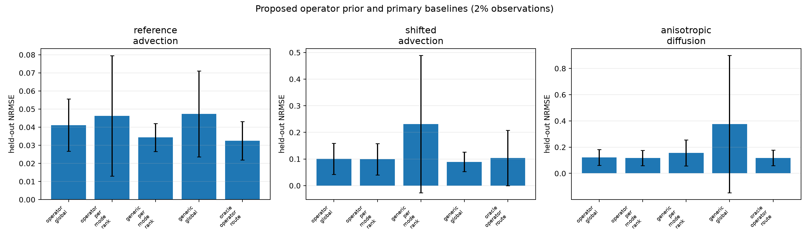
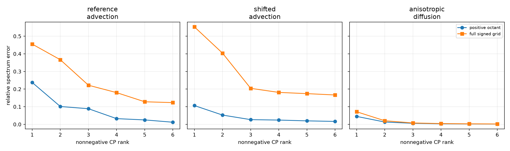

# Operator-Spectral FunBaT 论文级技术报告

> **版本**：2026-08-19 第三版（formulation 修订版）。
> **⚠ 本文第 6–9 节的 CP + 周期 Fourier 表述已被真实数据推翻并替换**，修订记录见 [第 14 节](#14-formulation-修订记录2026-08-19)。当前有效的方法与结果见该节。
> **原版本说明**：2026-08-19 结构重构版。
> **数值口径**：全部沿用 2026-08-16 投稿确认版，**本轮没有跑任何新实验**。
> **本轮改了什么**：把 Method 从 8 个小节压到 2 个核心组件；把 setting 从"假定算子已知"改写为**算子知识档位**；据此重新设计主实验（第 10 节，**待执行**）。
> **纪律声明**：已有全部实验都是**周期、常系数的可控合成机制验证**，且都站在知识档位的最高档 K2，不能表述为真实 PDE benchmark 的最终结果。
> **公式渲染**：全文使用 `$ ... $` / `$$ ... $$`，并避开 GitHub KaTeX 的已知限制（不用 `\operatorname`，math 内不出现 `\{` `\}` `\|` 与裸 `|`）。

---

## 目录

1. [一句话主线](#1-一句话主线)
2. [Introduction 草稿](#2-introduction-草稿)
3. [符号表](#3-符号表)
4. [与近邻工作的区别](#4-与近邻工作的区别)
5. [问题设定](#5-问题设定)
6. [方法：两个组件](#6-方法两个组件)
7. [模型与推断](#7-模型与推断)
8. [复杂度](#8-复杂度)
9. [已完成的 K2 档位确认](#9-已完成的-k2-档位确认)
10. [新主实验设计：沿知识档位的降级曲线（待执行）](#10-新主实验设计沿知识档位的降级曲线待执行)
11. [限制](#11-限制)
12. [可证伪 claims 与下一步](#12-可证伪-claims-与下一步)
13. [复现入口](#13-复现入口)
14. [附录 A：K2 确认实验完整数值表](#附录-ak2-确认实验完整数值表)
15. [附录 B：公平性控制（collapsed vs expanded）](#附录-b公平性控制collapsed-vs-expanded)
16. [附录 C：数值与工程细节](#附录-c数值与工程细节)

---

## 1. 一句话主线

我们研究**极稀疏观测下的连续张量补全**，并把物理先验的入口收缩到一个具体问题上：

> **不问"你知不知道解"，而问"你对控制这个场的算子知道多少"。**

答案有层级——系数全知、只知方程形式、只知物理类别、一无所知。本文给出一条链，把**任意一档**的算子知识转成 functional tensor 各维度的合法 GP kernel：

$$
\underbrace{\mathcal{L}_{\theta} \;\Longrightarrow\; S_{\mathrm{op}}(\boldsymbol{\omega};\theta)}_{\textbf{M1-a}}
\;\Longrightarrow\;
\underbrace{S_{\mathrm{op}}\approx\sum_{q}\lambda_q\,s_{1q}\circ\cdots\circ s_{Dq}}_{\textbf{M1-b}}
\;\Longrightarrow\;
\underbrace{s_{dr}=\rho+\sum_{q}\pi_{drq}\,s_{dq}}_{\textbf{M2}}
$$

其中 $\mathcal{L}_\theta$ 是算子族成员——**知识档位只决定拿哪些 $\theta$ 去做这条链，链本身不变**。方法只有**两个组件**：

| 组件 | 内容 | 为什么是它 |
|---|---|---|
| **M1** | 算子知识 $\to$ 联合谱 $\to$ 非负低秩分离 $\to$ 逐维**合法**一维 GP kernel | 非负性使每一步都保 PSD；不同知识档位只改变"用哪些谱去分离"，不改变这条链 |
| **M2** | 在 bank 上做凸组合，并保留一块**不可关闭**的通用谱 | 凸组合无法创造任何 atom 都没有的频率 support；floor 是**往下走知识档位时的保险** |

其余全部内容（CP 似然、有限 Fourier 变分推断、collapsed 参数化、routing 粒度）是**模型机器**与**公平性控制**，不是方法主张。

---

## 2. Introduction 草稿

### 2.1 问题背景

多维物理场经常只在少量传感器、少量时间点或少量工况上被观测。低秩 CP/Tucker 能利用多维相关性；functional tensor 进一步把离散 factor table 换成连续函数，因而可以在未观测坐标上插值。

但当观测率降到 1%–5% 时，单靠低秩不够。模型仍需决定每个连续因子**多平滑**、是否**振荡**、不同坐标方向是否应当**共享同一种变化尺度**。普通 functional Bayesian tensor 用 Matérn/RBF 等通用 GP 核回答这三个问题，等于放弃了一个几乎总是存在的信息源。

### 2.2 关键问题：你对算子知道多少？

真实场景里，"知道解"和"一无所知"之间有很宽的中间地带。我们把它显式分档：

| 档位 | 你掌握什么 | 现实例子 |
|---|---|---|
| **K2** | PDE 形式 **与全部系数** | 标定过的实验台；仿真数据且生成参数可见 |
| **K1** | **只知方程形式，系数未知**（仅知大致范围） | 知道是各向异性扩散/反应扩散，但介质的扩散张量未测 |
| **K0** | 只知物理类别 | "大概是扩散主导的输运" |
| **K−1** | 什么都不知道 | 退化为通用 GP kernel |

**这是本文 setting 的核心改写。** 以往把 physics-informed 方法写成"假定算子已知"，会立刻招致"谁真的知道 PDE"的质疑；而实际上 **K1 才是绝大多数场景所处的档位**，也应当是论文主打的档位。K1 的主张可以一句话说清：

> **我们不需要你知道系数，只需要你知道它是什么方程。**

### 2.3 结构冲突：为什么不能直接用算子谱

设线性平稳算子满足 $\mathcal{L}u=w$。在周期常系数近似下，解的功率谱为

$$
S_u(\boldsymbol{\omega})=\frac{S_w(\boldsymbol{\omega})}{\bigl\lvert\widehat{\mathcal{L}}(\boldsymbol{\omega})\bigr\rvert^{2}} .
$$

直接把 $S_u$ 当成一个巨大的 $D$ 维 GP 核会遇到三重冲突：

| 冲突项 | 说明 |
|---|---|
| **不可分性** | 物理谱耦合空间/时间/参数频率，写不成各维一维谱的乘积；而 functional CP/Tucker 依赖逐 mode 的一维函数 |
| **各向异性丢失** | 若强行让所有 mode 共享一个核，算子的方向性被抹平 |
| **退化为核搜索** | 若为每个 mode 自由学一个大字典，方法退化成缺少物理来源的 kernel search，"物理先验"这一卖点消失 |

### 2.4 方法直觉

不直接用 $S_u$，而是做**非负低秩分解**：

$$
S_{\mathrm{op}}(\omega_1,\ldots,\omega_D)\;\approx\;\sum_{q=1}^{Q}\lambda_q\prod_{d=1}^{D}s_{dq}(\omega_d),
\qquad \lambda_q\ge 0,\;\; s_{dq}\ge 0 .
$$

每个一维非负谱通过 Wiener–Khinchin 对应一个**半正定平稳核**。于是不可分的物理联合结构被换成一个**小型、合法、有算子来源**的一维核库。知识档位只影响"拿哪些 $S_{\mathrm{op}}$ 去分离"：K2 用一个，K1 在参数先验上采多个再池化，K0 用更宽的先验。**链条本身不变**。

**关键失败模式**：若近似算子遗漏了真实频率，仅在 bank 内部调权**无法创造新的 frequency support**——凸组合的 support 永远是各 atom support 并集的子集。因此我们保留一块**预先固定、不可被 softmax 关闭**的通用谱。档位越低，这块保险越重要。

### 2.5 贡献与边界

| # | 贡献 | 边界（必须写进正文，不能藏进附录） |
|---|---|---|
| **C1** | **从任意知识档位到合法逐维 GP kernel 的统一构造。** 非负低秩投影把不可分的 $D$ 维物理谱转成逐 mode 核，非负性保证 PSD；K1 通过参数族池化实现"形式已知、系数未知"。 | 只对 **even / axis-separable** 谱成立。含倾斜输运项的 advection 存在 cross-sign 耦合，当前实 Fourier 表示无法覆盖（见 §11）。 |
| **C2** | **固定 generic support floor 作为降档保险。** 自由字典不是 support 保证；固定非零 floor 能修复 operator prior 缺失的频率，并形成可量化的 robustness–specificity tradeoff。 | 这不是 automatic kernel discovery。floor 比例（25%）是在 development seeds 上只做一次的预声明最小重试。 |

**明确不主张**：从 2% 数据中识别每个 atom 的真实标签；routing 权重等于 PDE discovery 或系数反演。相关 atoms 高度相关，softmax top-1 不可识别，因此只用 induced spectrum 的 cosine / 相对 L2 作**连续诊断**。

**降级为消融或附录的内容**（原先在 Method 中）：routing 粒度（global / per-mode / per-mode-rank）是消融维度，其中 per-rank 只有弱信号；collapsed 参数化是**公平性控制**（附录 B）；数值细节见附录 C。

---

## 3. 符号表

| 符号 | 含义 |
|---|---|
| $D$ | tensor 阶数（POC 中 $D=3$，轴为 $x,y,t$） |
| $R$ | functional CP rank（已完成实验固定 $R=2$） |
| $K$ | 单边最高频率（$K=6$，即 $k=0,\dots,6$） |
| $F=1+2K$ | 每个 factor 的 Fourier feature 数（$F=13$） |
| $\theta\in\Theta$ | 算子族的物理参数（如扩散张量、反应系数） |
| $\mathcal{L}_\theta$ | 参数为 $\theta$ 的算子族成员 |
| $M$ | K1/K0 档位下从参数先验采样的组数 |
| $Q$ | bank 总 atom 数 |
| $Q_{\mathrm{gen}}$ | generic atom 数 |
| $\mathcal{O}$, $N_{\mathrm{obs}}$ | 观测索引集合与观测数 |
| $S_{\mathrm{op}}(\boldsymbol\omega)$ | 算子诱导的联合功率谱 |
| $s_{dq}(k)$ | 第 $d$ 个 mode、第 $q$ 个 atom 的一维单边非负谱 |
| $\pi_{drq}$ | mode $d$、rank $r$ 对 atom $q$ 的路由权重 |
| $\rho_q$ | atom $q$ 的固定 support floor（operator atoms 为 0） |
| $a_{dr}$ | Fourier 系数向量，变分对象 |
| $c_r$ | CP core 权重（点估计） |
| $e_Q$ | 秩 $Q$ 的谱分离相对误差 |

---

## 4. 与近邻工作的区别

| 工作 | 主要问题 | GP / tensor 结构 | 与本文的关键差别 |
|---|---|---|---|
| [FunBaT (2023)](https://arxiv.org/abs/2311.04829) | 连续坐标张量补全 | GP latent functions + Tucker；SDE / message passing | 使用**通用**逐 mode GP；不从算子联合谱构造 mode atoms，也没有知识档位的概念 |
| [RR-FBTC (2025)](https://arxiv.org/abs/2512.21486) | functional Bayesian tensor completion 与自动 rank 学习 | 多输出 GP + rank-revealing Bayesian tensor | 贡献在函数逼近能力与 rank 学习；本文**固定 rank**，研究算子谱的非负投影与错先验稳健性 |
| [Tensor GPs (2025)](https://arxiv.org/abs/2510.13772) | 高效求解非线性 PDE | 一维 GP factors + tensor decomposition；Newton/ALS | 它通过 collocation/PDE 方程**直接求解**，需要完整方程；本文做**有噪极稀疏补全**，且显式覆盖"系数未知"的 K1 档位 |
| [EPGP (ICML 2023)](https://proceedings.mlr.press/v202/harkonen23a.html) | 为常系数线性 PDE 构造 exact-solution GP prior | Ehrenpreis–Palamodov 原理，样本严格满足 PDE | EPGP 需要**完整已知**的 PDE（K2），样本严格满足方程；本文只近似解的**二阶频谱**，换来对 K1/K0 的支持与低秩 functional tensor 结构 |
| [Spectral Mixture Kernels (ICML 2013)](https://proceedings.mlr.press/v28/wilson13.html) | 从数据学习表达力强的平稳核 | 参数化频谱混合 | 本文的 atoms 来自算子族谱的**非负低秩投影**（物理可达集合），而非自由参数化；generic mixture 仅作降档保险 |

因此标题与摘要**不能**把"GP + tensor"或"PDE-informed GP"本身写成创新。最窄且可守住的定位是：

> **把算子族的不可分联合谱做非负低秩、保 PSD 的投影得到逐维 GP kernels，使得在"只知方程形式、不知系数"时仍可用；并用固定 generic support floor 为降档提供保险。**

---

## 5. 问题设定

### 5.1 观测模型

令连续 $D$ 阶场的观测为

$$
y_i=u(x_{i1},\ldots,x_{iD})+\epsilon_i,
\qquad \epsilon_i\sim\mathcal{N}(0,\sigma^{2}),
\qquad i\in\mathcal{O},
$$

其中 $N_{\mathrm{obs}}=\lvert\mathcal{O}\rvert$ 且 $N_{\mathrm{obs}}/N_{\mathrm{full}}\le 5\%$。目标是在其余坐标上恢复场，并在可能时输出 posterior predictive uncertainty。

### 5.2 算子知识档位（本文的核心设定）

设存在一个**算子族** $\lbrace\mathcal{L}_\theta:\theta\in\Theta\rbrace$，真值场由某个 $\theta^\star$ 生成。学习者掌握的信息按下表分档：

| 档位 | 形式化 | bank 构造 |
|---|---|---|
| **K2** | 已知 $\theta^\star$ | 分离 $S_{\mathrm{op}}(\theta^\star)$，得 $Q$ 个 atom |
| **K1** | 已知算子族，且已知 $\theta^\star\in\Theta_1$（$\Theta_1$ 为预先声明的范围） | 从 $\Theta_1$ 采 $M$ 组 $\theta_m$，各自分离，atom **池化**成 bank |
| **K0** | 只知更宽的 $\Theta_0\supset\Theta_1$ | 同上，但先验更宽 |
| **K−1** | 无算子信息 | generic dictionary |

在 K1/K0 下，routing 权重 $\pi$ 实际在做**软参数推断**：它在"物理可达的谱"张成的集合内选择混合，而不是在无约束的核空间里搜索。

**必须预先写清的退化边界。** 当 $\Theta$ 宽到覆盖全部物理合理范围时，池化 bank 会逐渐逼近一个通用字典，方法优势**必然**趋于消失。这不是缺陷而是**可证伪的预测**（见 §10.4 的 P4）：如果 K0 与 K−1 的差距在合理宽度下就已经不显著，则"物理来源"这一卖点在该算子族上不成立。

**与 generic dictionary 的可守区别**：K1 bank 只张成算子族**物理可达**的谱集合，它是同等 atom 数的通用字典的一个**受限子集**。检验这一点的对照是"**atom 数完全相同的 generic bank**"（§10.3）。

### 5.3 张量模型

POC 使用三阶连续 CP：

$$
u(x_1,x_2,x_3)=\sum_{r=1}^{R}c_r\,f_{1r}(x_1)\,f_{2r}(x_2)\,f_{3r}(x_3).
$$

选择 CP 而非 dense Tucker 是为了**隔离 kernel prior 的贡献**，避免把收益混入额外 core 参数。扩展到 Tucker 只需把对角权重 $c_r$ 换成小 core $G_{r_1r_2r_3}$。

---

## 6. 方法：两个组件

### 6.1 M1：从算子知识到合法一维 kernel bank

#### M1-a 算子 $\to$ 联合解频谱

对周期常系数算子，$\widehat{u}(\boldsymbol\omega)=\widehat{w}(\boldsymbol\omega)/\widehat{\mathcal{L}}(\boldsymbol\omega)$，故

$$
S_{\mathrm{op}}(\boldsymbol\omega;\theta)=\bigl\lvert\widehat{\mathcal{L}}_\theta(\boldsymbol\omega)\bigr\rvert^{-2}S_w(\boldsymbol\omega).
$$

当前实现（`operator_joint_spectrum`）覆盖三类机制，轴序为 $(\omega_x,\omega_y,\omega_t)$，激励取各向同性高斯 $S_w=\exp(-\alpha\Vert\boldsymbol\omega\Vert^2)$：

| 机制 | $\lvert\widehat{\mathcal L}_\theta\rvert^{2}$ | 未知参数 $\theta$ | 谱结构 |
|---|---|---|---|
| **各向异性扩散（主线）** | $\bigl(\kappa+D_x\omega_x^2+D_y\omega_y^2+D_t\omega_t^2\bigr)^2$ | $(\kappa,D_x,D_y,D_t)$ | 逐轴平方项之和，**even 且接近可分** |
| advection–diffusion | $\bigl(\kappa+D_x\omega_x^2+D_y\omega_y^2\bigr)^2+\bigl(\omega_t+v_x\omega_x+v_y\omega_y\bigr)^2$ | 上述 $+\,(v_x,v_y)$ | 含**跨符号耦合**的输运项 |
| damped wave | $\bigl(c_x\omega_x^2+c_y\omega_y^2-\omega_t^2\bigr)^2+\bigl(\gamma_0+\gamma_1\lvert\omega_t\rvert\bigr)^2$ | $(c_x,c_y,\gamma_0,\gamma_1)$ | 能量集中在倾斜 dispersion surface 附近 |

**主线锁定各向异性扩散/反应扩散族**，其 K1 未知量即**未知扩散张量与反应系数**——物理上就是"知道是扩散，但没测过介质"。advection 与 wave 作为压力测试与 limitation（§11）。

#### M1-b 非负低秩谱分离

在离散频率网格上求

$$
\min_{\lambda_q\ge 0,\;s_{dq}\ge 0}\;
\Bigl\Vert\,S_{\mathrm{op}}-\sum_{q}\lambda_q\, s_{1q}\circ\cdots\circ s_{Dq}\,\Bigr\Vert_F^{2}.
$$

实现（`nonnegative_cp_spectrum`）采用确定性 seed 的非负 CP 乘性更新（Euclidean loss，MTTKRP 形式），每轮把各 mode factor 的范数收进 $\lambda_q$。每个一维 factor 随后归一化到单位 marginal variance。

分离误差 $e_Q=\Vert S_{\mathrm{op}}-\widehat{S}_Q\Vert_F/\Vert S_{\mathrm{op}}\Vert_F$ 是**方法适用性的先验诊断**，必须**分别报告 positive octant 与 full signed grid**（§9.4）。

#### M1-c 命题：非负谱保证合法核

在一维周期网格上，对任意非负单边谱 $s(k)$ 定义

$$
\phi_s(x)=\Bigl[\;\sqrt{s(0)},\;\;\bigl\lbrace\sqrt{2s(k)}\cos(2\pi kx)\bigr\rbrace_{k=1}^{K},\;\;\bigl\lbrace\sqrt{2s(k)}\sin(2\pi kx)\bigr\rbrace_{k=1}^{K}\;\Bigr].
$$

则

$$
k_s(x,x')=\phi_s(x)^{\top}\phi_s(x')=s(0)+2\sum_{k=1}^{K}s(k)\cos\bigl(2\pi k(x-x')\bigr)
$$

必然半正定；对非负凸组合 $s_{dr}(k)=\sum_q \pi_{drq}s_{dq}(k)$ 同样成立。因此**非负 CP $\to$ 参数族池化 $\to$ routing softmax $\to$ 最终核**，每一步都不破坏 PSD。

> **必须留在正文的边界**：$s_{dq}(k)$ 是**单边 magnitude spectrum**，实 Fourier features 把 $+k$ 与 $-k$ 成对，因此当前 hypothesis class 表示的是**逐轴 even、separable 的协方差分量**。各向异性扩散的 symbol 由各轴平方项构成，与该表示匹配，这是主线选它的**数学理由**，不只是结果好看。

#### M1-d 按知识档位构造 bank

| 档位 | 构造 | atom 数 |
|---|---|---|
| K2 | 分离 $S_{\mathrm{op}}(\theta^\star)$ | $Q_{\mathrm{op}}$ |
| K1 | $\theta_1..\theta_M \sim \mathrm{LHS}(\Theta_1)$，各分离出 $Q_1$ 个 atom 后池化 | $M\,Q_1$ |
| K0 | 同上，$\Theta_0\supset\Theta_1$ | $M\,Q_1$ |
| K−1 | generic dictionary | $Q_{\mathrm{gen}}$ |

$\Theta_1,\Theta_0,M,Q_1$ 必须在看到任何测试数据前冻结。池化后可做去重/剪枝，但规则同样预先声明。

> **为什么这一步在工程上可行**：K1 的 bank 比 K2 大 $M$ 倍，若变分系数随 atom 数增长，K1 就会因为参数更多而"赢在预算上"。**collapsed 参数化正是使这件事可比的前提**——GP 系数量固定为 $2DR(1+2K)$，与 bank 大小无关，K1 相对 K2 只多出 routing logits。推导见附录 B。

### 6.2 M2：mixture 与 guaranteed support floor

最终候选谱库为算子 atoms 与 generic atoms 的并集，routing 被约束为

$$
\pi_{drq}=\rho_q+\Bigl(1-\sum_{j}\rho_j\Bigr)\,\mathrm{softmax}(\alpha_{dr})_q,
$$

其中 operator atoms 的 $\rho_q=0$，generic atoms 均分总计 25% 的**固定 floor**；routing 以 operator logits $=0$、generic logits $=-2$ 初始化。

这**不是**"自由字典会自动适配"。Floor 明确用一部分 matched-prior 精度换取 support safety。已完成的 development 审计（seeds 101–105，K2 档位，**算子为 `reference_advection`，不是主线扩散族**——这张表来自 `run_escape_floor_development.py`，容易被误读为主线数字）：

| 方法 | matched NRMSE | strict wrong-support NRMSE |
|---|---:|---:|
| operator per-mode/rank | **0.0396 ± 0.0066** | 0.6195 ± 0.2149 |
| generic per-mode/rank | 0.1292 ± 0.1390 | — |
| operator + generic（25% floor） | 0.0467 ± 0.0085 | **0.0480 ± 0.0079** |

matched 上 robust 0/5 战胜 operator-only（平均代价 $+0.0071$），wrong-support 上 5/5 改善（平均收益 $-0.5714$）：一个明确的 **robustness–specificity tradeoff**。

> **在新框架下 floor 的定位变了**：它不再是一个孤立的稳健性 trick，而是**沿知识档位下行时的保险**。预测是：档位越低，floor 的边际收益越大（§10.4 的 P3）。

---

## 7. 模型与推断

本节是标准机器，不含方法主张。

**似然与因子**：functional CP（§5.3），每个因子由 collapsed 混合谱的单套 Fourier features 与系数给出，

$$
s_{dr}=\sum_q \pi_{drq}s_{dq},
\qquad
f_{dr}(x)=\phi_{s_{dr}}(x)^{\top}a_{dr},
\qquad
a_{dr}\sim\mathcal{N}(0,I).
$$

变分系数量固定为 $2DR(1+2K)$，**与 bank atom 数无关**（确认实验中恒为 156 个）。等价性推导与 expanded 版本的对比见附录 B。

**变分族**：每个 Fourier 系数 mean-field Gaussian $q(a_{dr})=\mathcal{N}(\mu_{dr},\mathrm{diag}(\sigma_{dr}^{2}))$；CP core $c_r$、routing logits $\alpha$ 与观测噪声 $\sigma_y$ 为点估计。目标

$$
\mathcal{F}=\mathbb{E}_{q}\Bigl[\sum_{i\in\mathcal{O}}\log p(y_i\mid f,c,\sigma_y)\Bigr]-\sum_{d,r}\mathrm{KL}\bigl[q(a_{dr})\,\Vert\,p(a_{dr})\bigr].
$$

3 个 reparameterized MC samples，Adam，400 steps；观测率 $\le 2\%$ 时使用完整 observed batch，loss 除以 $N_{\mathrm{obs}}$（per-observation negative ELBO）。所有方法共享学习率、gradient clipping、初始化随机流与 step 数。数值细节（零 support 处的 $\sqrt{\cdot}$ 梯度处理等）见附录 C。

> $\alpha$ 是通过 ELBO 优化的**确定性 kernel hyperparameter**，没有为 routing 构造变分 posterior，因此 routing softmax **不能**解释成 Bayesian model probability，UQ 也不包含 kernel-routing uncertainty。

**Predictive uncertainty 的准确表述**：训练完全结束后，用 64 个 posterior predictive samples、在 1024 个未观测位置报告 95% 区间 coverage、MC posterior predictive NLL 与区间宽度；评估目标是额外独立加噪的 held-out observations。这是**有限 Fourier + mean-field variational posterior predictive**，不是解析 exact GP posterior。

---

## 8. 复杂度

| 项 | 规模 |
|---|---|
| 变分系数与尺度参数 | $2DRF$，**与 $Q$ 无关** |
| mode/rank routing 参数 | $DRQ$（global 为 $Q$） |
| 每个 MC sample 的观测预测 | $O(N_{\mathrm{obs}}DRF)$ |
| operator joint spectrum 网格 | $O\bigl((K+1)^{D}\bigr)$ 存储，K1/K0 下乘以 $M$ |
| 非负 CP 分离 | 随分离迭代数、rank 与联合谱网格线性增长，K1/K0 下乘以 $M$ |

主要扩展瓶颈**不是** tensor completion，而是高维联合 spectrum grid 的 $O((K+1)^{D})$ 存储；K1/K0 的 $M$ 倍开销是**一次性预处理**，不进入训练循环。未来可用解析 symbol、稀疏频率采样或 tensor-train 表示替代完整网格。

---

## 9. 已完成的 K2 档位确认

> **定位**：本节全部结果都在**知识档位最高档 K2**（生成参数对 bank 构造完全可见）。它们验证的是 M1/M2 的**机制**，不是论文最终主实验。新主实验见 §10。

### 9.1 冻结协议

| 项 | 设定 |
|---|---|
| development / audit seeds | 101–105，仅用于发现数值问题与冻结协议 |
| confirmation seeds | 201–205，协议冻结后一次性运行 |
| 网格 / 观测率 | $24^3$；2%（约 276 个训练观测） |
| CP rank / atoms | 2；operator 4 + generic 4 |
| frequency support | $k=0,\ldots,6$，每 factor 13 个 Fourier features |
| optimizer | Adam，400 steps，3 个 ELBO samples；**无 validation、无 early stopping** |
| 共享项 | 同一 (case, seed) 下所有方法共享场、mask、训练噪声与 UQ targets |

### 9.2 主表（untouched seeds 201–205，held-out NRMSE）

| setting | operator-global | operator per-mode/rank | generic-global | generic per-mode/rank | oracle route |
|---|---:|---:|---:|---:|---:|
| reference advection | 0.0411 ± 0.0144 | 0.0462 ± 0.0332 | 0.0474 ± 0.0237 | **0.0343 ± 0.0077** | 0.0325 ± 0.0106 |
| shifted advection | 0.1006 ± 0.0586 | 0.0995 ± 0.0590 | **0.0892 ± 0.0369** | 0.2312 ± 0.2580 | 0.1042 ± 0.1041 |
| **anisotropic diffusion（主线）** | 0.1212 ± 0.0606 | **0.1183 ± 0.0582** | 0.3761 ± 0.5235 | 0.1567 ± 0.0990 | 0.1183 ± 0.0588 |

- **主线信号**：各向异性扩散上，operator per-mode/rank 相对参数匹配的 generic per-mode/rank 平均 NRMSE 降低约 **24.5%**，**5/5 paired wins**，并追平 oracle mean（0.1183 vs 0.1183）。
- 相对 operator-global 只有约 **2.4%** 均值改善、**3/5** wins：证据支持 **operator-derived mode kernels**，但**不支持**把自由 per-rank routing 单独当作贡献。
- advection 两个 setting 不形成一致 winner（reference case 有 4/5 paired wins 但 seed 203 的 $0.111$ 优化 outlier 反转均值；shifted case 的 generic-global 均值最好）。结合 §9.4 的 signed 审计，它们是**边界证据**而非正证据。

各向异性扩散的连续诊断与预测一致：

| 方法 | induced-spectrum cosine ↑ | spectrum 相对 L2 ↓ | predictive NLL ↓ | 95% coverage |
|---|---:|---:|---:|---:|
| operator-global | 0.972 | 0.269 | −0.642 | 0.956 |
| operator per-mode/rank | **0.977** | **0.204** | **−0.679** | 0.947 |
| generic per-mode/rank | 0.926 | 0.427 | −0.451 | 0.960 |
| oracle | 1.000 | 0.000 | −0.678 | 0.946 |

### 9.3 Strict support mismatch（floor 的动机实验）

| setting | wrong-support operator | 25% floor robust | paired wins |
|---|---:|---:|---:|
| reference advection | 0.6723 ± 0.1938 | **0.0402 ± 0.0096** | 5/5 |
| shifted advection | 0.6318 ± 0.0883 | **0.0847 ± 0.0414** | 5/5 |
| anisotropic diffusion | 0.6149 ± 0.1798 | **0.1301 ± 0.0621** | 5/5 |

matched 各向异性扩散上 robust 为 $0.1308\pm0.0624$，比 operator-only 的 $0.1183\pm0.0582$ 差约 $0.0124$；prior 被删频时却恢复到几乎相同的 $0.1301$。

> **这个对照的已知弱点**：「删掉所有 $k\ge2$ 的 operator support」在物理上是人工的，reviewer 会问"谁会这样错"。§10 用**知识档位**把它替换成物理上有意义的连续轴；本表在新版论文中降级为附录中的极端点对照。

### 9.4 Signed vs octant 可分性审计

| rank | ref. adv (oct / signed) | shift. adv (oct / signed) | aniso diff (oct / signed) |
|---:|---:|---:|---:|
| 1 | 0.2374 / 0.4552 | 0.1064 / 0.5528 | 0.0450 / 0.0713 |
| 2 | 0.1012 / 0.3664 | 0.0525 / 0.4036 | 0.0131 / 0.0203 |
| 3 | 0.0886 / 0.2218 | 0.0266 / 0.2042 | 0.0058 / 0.0078 |
| 4 | 0.0323 / 0.1799 | 0.0242 / 0.1812 | 0.0030 / 0.0043 |
| 5 | 0.0251 / 0.1280 | 0.0197 / 0.1742 | 0.0021 / 0.0029 |
| 6 | 0.0120 / 0.1233 | 0.0165 / 0.1666 | 0.0016 / 0.0021 |

advection 在单个 octant 上看似可分，对称扩展后仍有**当前逐轴实核无法表示的耦合**（signed 误差在 rank 6 仍 $>0.12$）；各向异性扩散没有这个缺口（rank 4 已达 0.0043）。**这是主线选扩散族的数学依据。**

### 9.5 K2 档位的 gate 判断

| 判断 | 内容 |
|---|---|
| **GO** | 各向异性扩散上 operator kernels 相对 generic 有 5/5 paired wins、更好的 induced spectrum 与 NLL；rank-4 full signed 谱误差仅 0.0043 |
| **弱信号** | per-mode/rank routing 仅小幅优于 operator-global（3/5 wins，~2.4%），降为消融 |
| **GO（次要）** | 固定 25% generic floor 在三类 strict mismatch 上全部 5/5 wins，matched 代价可测且小 |
| **NO-GO** | 当前实可分特征**不能**把 advection 的 positive-octant 低误差解释成完整倾斜输运谱 |

---

## 10. 新主实验设计：沿知识档位的降级曲线（待执行）

> **状态：设计已执行到 development 阶段。** §10.1–10.5 是冻结前的设计；**§10.7 是 2026-08-19 在 development seeds 101–105 上跑出的结果**，含三条被否证的预测。确认实验（seeds 301–305）尚未运行。

### 10.1 为什么换

现有主表回答的是"算子已知时是否有用"（K2），而论文真正要回答的是"**算子只知形式时是否仍然有用**"（K1）。同时，现有的 misspecification 只有 matched 与"删频"两个端点，中间空白——这恰是原报告自己列出的待办项。新主实验把**知识档位**作为主轴，一张表同时回答这两件事。

### 10.2 K1 bank 的构造（预先声明）

主线算子族：**各向异性扩散/反应扩散**，$\theta=(\kappa,D_x,D_y,D_t)$。

- 真值 $\theta^\star$ 用于生成场，**不对 K1/K0 的 bank 构造可见**；
- $\Theta_1$：每个分量在 $\theta^\star$ 附近的**对数均匀**区间（宽度预先声明，例如 $\times[1/3,3]$）；
- $\Theta_0$：更宽区间（例如 $\times[1/10,10]$）；
- 采样：Latin hypercube，$M$ 组，确定性 seed；
- 每组分离出 $Q_1$ 个 atom，池化为 $M Q_1$ 个；
- 去重/剪枝规则（若用）预先声明，不按结果调整。

**实现判断**：用参数族池化，而非梯度学 $\theta$。`operator_joint_spectrum` 对 $\theta$ 可导，但 `nonnegative_cp_spectrum` 是 numpy 乘性更新、不可导，端到端学 $\theta$ 需每步重新分离，代价不划算；池化版也不引入新的可识别性主张。梯度/摊销版本列为 future work。

### 10.3 实验矩阵

**主表**：同一批真值场，横轴为知识档位。

| 档位 | bank | 是否用 floor |
|---|---|---|
| K2 | $S_{\mathrm{op}}(\theta^\star)$ 分离 | 各跑一次：无 floor / 25% floor |
| K1 | $\Theta_1$ 池化 | 同上 |
| K0 | $\Theta_0$ 池化 | 同上 |
| K−1 | generic dictionary | — |
| oracle | 真值 component route | — |

**必须同时报告的公平性对照：**

1. **atom 数匹配的 generic bank** —— atom 数与 K1 完全相同的通用字典。这是检验"物理可达子集 vs 任意字典"的关键对照；缺了它，K1 的收益可以被解释成"bank 更大"。
2. **wrong-family bank** —— 用**错误算子族**（如用 wave 族的谱）做同样的 $M$ 组池化，atom 数相同。检验收益是否真的来自正确的物理族。
3. **可训练参数量与 wall-clock** —— 逐方法列出，GP 系数量应恒定，只有 routing logits 随 $Q$ 变化。

**辅助指标**：induced-spectrum cosine / 相对 L2、95% coverage、predictive NLL、逐 seed paired wins。

### 10.4 预注册的可证伪预测

在跑之前写死，跑完逐条对照：

| # | 预测 | 否证条件 |
|---|---|---|
| **P1** | 均值序 $\mathrm{NRMSE}(\mathrm{K2})\le \mathrm{K1}\le \mathrm{K0}\le \mathrm{K{-}1}$（允许 K2 $\approx$ K1） | 出现非单调反转且跨 seeds 稳定 |
| **P2** | K1 相对 K−1 的收益 $\ge$ K2 相对 K−1 收益的 **50%** | 低于 50%，则"只知形式就够"这一主张不成立，论文需退回 K2 定位 |
| **P3** | floor 的边际收益**随档位下降而增大** | floor 收益与档位无关，则 floor 只是通用正则，不是"降档保险" |
| **P4** | K0 与 K−1 仍有可测差距 | 无显著差距，则物理来源在 $\Theta_0$ 宽度下已失效——**这是方法适用范围的上界，必须照实报告** |
| **P5** | K1 优于 **atom 数匹配的 generic bank** | 不优，则收益来自 bank 容量而非物理，C1 需大幅收缩 |
| **P6** | K1 优于 **wrong-family 池化 bank** | 不优，则"正确算子族"没有起作用 |

P4、P5、P6 是本设计里最可能失败的三条，也是最有信息量的三条。

### 10.5 冻结规则

- **seeds 201–205 已在 §9 公开，视为已看过**；新主实验使用**全新未接触的 301–305**。
- development 阶段只用 101–105 调 $\Theta_1/\Theta_0$ 宽度、$M$、$Q_1$ 与剪枝规则；一经冻结不得再改。
- 沿用早期预算纪律：3–5 seeds × 400 steps；checkpoint 只看完整 observed loss。
- 若 P5 或 P6 在 development 阶段就失败，**停止扩预算**，先修 bank 构造而不是加 seeds。

### 10.7 Development 结果（seeds 101–105，2026-08-19）

> 全部数值来自 `results/knowledge_ladder_development/`。**development seeds 已暴露，这些数字永远不得进入主表。**
> 环境保真度：本轮环境重跑已发表的冻结点（anisotropic diffusion, seed 201）与存档 JSON 逐方法最大差 `1.1e-07`，分离误差完全一致，故新旧数字可比。

主线设置：各向异性扩散，$\theta=(\kappa,D_x,D_y,D_t)$，$\Theta_1=\times[1/3,3]$，$M=6$，$Q_1=2$（池化 12 atoms），2% 观测，400 steps。

| 方法 | bank | mean NRMSE | std | atoms | 可训练参数 |
|---|---|---:|---:|---:|---:|
| oracle route | K2 | 0.0431 | 0.0138 | 4 | 159 |
| **K2**（真系数） | 单点分离 | 0.0440 | 0.0073 | 4 | 183 |
| **K1**（池化 6 组） | $\Theta_1$ 池化 | **0.0438** | 0.0079 | 12 | 231 |
| **K1-single**（单个错误猜测） | 单点分离 | 0.0440 | 0.0080 | 4 | 183 |
| K0 | $\Theta_0$ 池化 | 0.0550 | 0.0170 | 12 | 231 |
| wrong family（advection） | 池化 | 0.0469 | 0.0074 | 12 | 231 |
| K−1 generic（atom 数匹配） | 通用字典 | 0.0509 | 0.0078 | 12 | 231 |
| K−1 generic（4 atoms） | 通用字典 | 0.0780 | 0.0645 | 4 | 183 |

所有方法的变分系数恒为 **156**，可训练参数只差 routing logits；K1 与其关键对照 generic-matched 同为 231。

#### 逐条判定

| 预测 | 判定 | 说明 |
|---|---|---|
| **P1** 档位单调 | **通过（按预注册容差）** | 序列 `[0.0440, 0.0438, 0.0550, 0.0780]`；K2 与 K1 差 0.0002 属噪声，预注册原文明确"允许 K2 ≈ K1"。**但脚本里的自动检查用了严格 `<=`，输出 `false`**；这是实现与预注册不一致，记录在案，不修改判据事后粉饰。 |
| **P2** K1 保留 K2 收益的 ≥50% | **通过（强）** | 保留率 **100.7%**。换用稳定基线（generic-matched，std 0.0078，而 generic4 的 std 高达 0.0645）重算仍为 **103%**。 |
| **P3** floor 收益随档位下降而增大 | **否证；且预测本身写错了** | floor 在每档都是纯代价（K2 `+0.0182`、K1 `+0.0184`、K0 `+0.0067`），且在 K0 代价更小。原因：**知识档位下降并不制造 support 缺失**，而 floor 保的正是缺失。要检验 floor 必须把档位轴与删频轴**交叉**。 |
| **P4** K0 仍优于 K−1 | **初判失败，后被 width sweep 推翻** | 对 generic-matched，K0（0.0550）确实更差。但 width sweep 显示 $\times1.5\to\times20$ 的池化 bank 平坦在 `0.0437–0.0446`：**K0 的 0.0550 是一次不走运的 LHS 抽样（不同 LHS seed），不是宽度效应**。退化边界在 $\times20$ 内**没有**出现。 |
| **P5** K1 优于 atom 数匹配的 generic | **通过，5/5** | 同 12 atoms、同 231 参数，逐 seed 全胜（0.0438 vs 0.0509）。且 K1 的 bank 冗余得多（两两 cosine 0.933 vs 0.614），是用更小的有效容量赢的。**目前唯一干净支撑"物理来源有用"的证据。** |
| **P6** K1 优于 wrong-family | **名义通过 4/5，实质很弱** | advection 池化 0.0469，仅差 0.0031，却仍优于 generic-matched。大部分收益来自"算子形状的低通谱"，而非"正确的那个算子"。 |

#### 三个未预料到的结果

**(a) 池化对均值毫无贡献，但能降方差。** `K1-single`（单个随机抽的错误系数、4 atoms）均值 `0.0440`，与 6 组池化和真系数完全打平。width sweep 给出了池化的真实作用：

| 先验宽度 | 池化（12 atoms） | 单点猜测（4 atoms） |
|---|---:|---:|
| ×1.5 | 0.0437 ± 0.0076 | 0.0540 ± 0.0172 |
| ×3 | 0.0438 ± 0.0079 | 0.0440 ± 0.0080 |
| ×5 | 0.0436 ± 0.0080 | 0.0420 ± 0.0073 |
| ×10 | 0.0443 ± 0.0079 | 0.0447 ± 0.0115 |
| ×20 | 0.0446 ± 0.0078 | 0.0645 ± 0.0335 |

池化的 std 在所有宽度上稳定在 `~0.0078`；单点猜测的 std 在 `0.0073–0.0335` 之间摆动，均值在两端劣化。**池化买的是"抗一次坏猜测"的方差，不是均值。** "routing 在做软参数推断"这一叙事没有证据支持，应删除。

**(b) 真正的风险轴不是系数误差，而是算子族的谱距离。** 加入谱形差异大得多的 wave 族对照（rank-2 分离误差 `0.14–0.34`，advection 仅 `0.05–0.10`）：

$$
\underbrace{0.0438}_{\text{K1}}\;<\;\underbrace{0.0469}_{\text{advection}}\;<\;\underbrace{0.0509}_{\text{generic}}\;<\;\underbrace{0.0544}_{\text{wave}}
$$

谱上接近的错误算子几乎无害；**谱上遥远的错误算子比完全不用物理还差**。这才是 floor 该保的东西，也把"谱可分离性作为适用性指标"推广成"谱距离作为风险指标"。

**(c) 一个 a-priori 判据被否证，另一个成立。** 在不训练的前提下评估 bank：

| 诊断 | 定义 | 与 NRMSE 的 Spearman |
|---|---|---:|
| reachability | bank 凸组合能**逼近**真值谱的最好程度 | **0.28（等于无效）** |
| prior concentration | 在 router 自己的均匀单纯形先验下，**典型**混合离真值多远 | **0.818** |

wave 的 reachability 排第二（0.034）却预测最差：**可达性只度量表达力，好的先验必须既近又紧**。$n=11$ 且样本是 bank 而非独立重复，因此这是启发性的，不是已确立的判据。

#### 对定位的影响

可守的说法从"池化实现软参数推断"收缩为两句，**都比原说法更简单**：

1. **算子谱先验对系数误差极不敏感**——$\times[1/3,3]$ 内单点猜测即可，池化只提供方差保护；
2. **但它对算子族身份的分辨力有限**，且在谱距离足够远时会**主动有害**。

方法因此可以再砍一层：K1 不需要参数族池化机器，正文只需"代入任一合理系数"，池化降为可选的方差控制。

#### 下一步（尚未执行）

1. 把知识档位轴与 **support 删频轴交叉**，重新检验 floor（P3 需要重写）；
2. 检验 `wave + floor` 是否能把"谱距离过远反而有害"救回来——这是 floor 目前最有可能真正起作用的场景；
3. 用多个 LHS seed 重复池化 bank 构造，把"bank 抽样方差"与"宽度效应"分开（K0 的教训）；
4. 上述结论全部来自与模型同源的合成数据，仍需 PDEBench diffusion 的外部 gate。

### 10.6 之后的外部数据 gate

按 [`DATASETS_AND_RESOURCES.md`](DATASETS_AND_RESOURCES.md)：合成 K1 机制通过后，下一关是 **PDEBench diffusion**——真值解**不来自本模型的 finite atom family**，且 PDE 参数由官方生成器给出，天然支持 K2/K1 对照。manifest 需记录 `operator_parameters_visible_to_learner` 以区分档位。

---

## 11. 限制

1. **合成数据同源**：现有 synthetic field 从与模型相同的有限 operator atom family 采样，属机制 sanity，不是外部证据。§10.6 的 PDEBench gate 专门解决这一条。
2. **只表示 even / axis-separable 协方差**：实轴向 Fourier features 无法表示倾斜输运的 cross-sign coupling；advection 的 full signed 分离误差在 rank 6 仍 $>0.12$。这是主线选扩散族的原因，也是重新纳入 advection 前必须先解决的问题（需 signed-conjugate、复数 factors 或显式 cross-mode phase）。
3. **知识档位的退化边界**：$\Theta$ 足够宽时池化 bank 逼近通用字典，优势必然消失（§10.4 P4）。
4. **routing 是点估计**：UQ 不包含 kernel-routing uncertainty；routing softmax 不是 Bayesian model probability。
5. **mean-field 忽略 CP factors 间 posterior correlation**；周期 Fourier prior 不处理边界条件与非平稳系数。
6. **rank 固定为 2**，未与 rank-learning 方法正面竞争。
7. **非负 CP 存在局部最优与 component permutation**：只使用重构误差与 induced spectrum，不解释 component label。
8. **$\lambda_q$ 未进入 routing prior**：联合谱 component weights 因与 CP core scale 不可识别而只被记录；真实数据版本应检验用 $\lambda_q$ 初始化/正则化 routing 是否更合理。

---

## 12. 可证伪 claims 与下一步

### 已验证或已否证（K2 档位）

| # | claim | 结论 |
|---|---|---|
| 1 | even/axis-separable 的各向异性扩散 **full signed** 谱可由少量一维 PSD atoms 高精度表示 | **验证**（rank-4 误差 0.0043） |
| 2 | 2% 观测下 operator-derived mode kernels 在扩散族上胜过参数匹配的 generic kernels | **验证**（5/5 paired wins） |
| 3 | per-mode/rank routing 相对 operator-global 有独立贡献 | **弱信号**（3/5 wins，~2.4%），降为消融 |
| 4 | 自由选择即 support 保证 | **否证**；固定 25% floor 在 strict deletion 下三类 setting 均 5/5 恢复 |
| 5 | 上述结论在 bank-size-independent coefficient budget 下成立 | **验证**（collapsed 参数化，156 个系数恒定） |
| 6 | 核权重可直接识别 PDE / atom label | **否证**（atom top-1 仅 22–33%；相同 Fourier span 下 posterior 可补偿幅值失配） |

### 下一阶段的真正 gate

1. **K1 机制**（§10）：只知方程形式时优势是否保留 —— 本轮下一步；
2. **外部数据**：PDEBench diffusion 上，真值不来自本模型 atom family 时是否仍稳定优于 FunBaT / generic functional tensor；
3. observation ratio 1%/2%/5% 与 structured sensor masks 下形成可解释 phase diagram；
4. 非周期边界、变系数下优势不能完全消失；
5. 若要重新纳入 advection，必须先实现并验证 signed-conjugate / 复数 / cross-mode phase factors；
6. predictive UQ 需在独立 PDE 数据上维持合理 coverage / NLL。

### 投稿前仍需要

1. 至少一个**不由本模型 atom 直接生成**的 PDE solution dataset；
2. 与 FunBaT、RR-FBTC 和 neural / functional CP 的统一 sparse-mask baseline；
3. §10 的知识档位降级曲线（替代原先"matched / 删频两个端点"）；
4. 非负分离 rank、$M$、generic atom 数、tensor rank 与 observation ratio 的 ablation；
5. 若进入真实非周期域，明确边界误差以及 periodic-prior 的 failure case。

---

## 13. 复现入口

| 内容 | 路径 |
|---|---|
| 核心模型 | `src/geoaware/operator_spectral_funbat.py` |
| K2 投稿确认（collapsed） | `experiments/run_submission_confirmation.py` |
| signed vs octant 审计 | `experiments/audit_signed_operator_spectrum.py` |
| basis 修复后重跑 strict controls | `experiments/rerun_strict_support_after_basis_fix.py` |
| generic floor development | `experiments/run_escape_floor_development.py` |
| 旧 expanded POC | `experiments/run_operator_spectral_poc.py` |
| K2 主表数值来源 | `results/submission_confirmation/summary.json` |
| signed 审计结果 | `results/signed_spectrum_audit/summary.json` |
| 旧 expanded 结果（**不得与主表合并**） | `results/advanced_poc_r1_r5/` |
| 单元测试 | `tests/test_operator_spectral_funbat.py` |
| 数据集与外部资源路线图 | `docs/DATASETS_AND_RESOURCES.md` |
| 论文 LaTeX 工程 | `paper/` |
| **K1 知识档位实验** | **待实现** |

---

## 附录 A：K2 确认实验完整数值表

seeds 201–205，2% 观测，400 steps，rank 2，$k\le 6$。格式：mean ± std。

### A.1 reference advection–diffusion

| 方法 | NRMSE | spectrum cosine | spectrum rel. L2 | 95% coverage | predictive NLL |
|---|---:|---:|---:|---:|---:|
| operator-global | 0.0411 ± 0.0144 | 0.8337 ± 0.0149 | 0.6936 ± 0.0325 | 0.9963 | −1.1080 |
| operator per-mode/rank | 0.0462 ± 0.0332 | 0.8175 ± 0.0641 | 0.6278 ± 0.1765 | 0.9949 | −0.9443 |
| generic-global | 0.0474 ± 0.0237 | 0.8413 ± 0.0011 | 0.6867 ± 0.0065 | 0.9932 | −1.0311 |
| generic per-mode/rank | 0.0343 ± 0.0077 | 0.8239 ± 0.0138 | 0.6923 ± 0.0273 | 0.9973 | −1.1414 |
| robust-global | 0.0392 ± 0.0120 | 0.8340 ± 0.0110 | 0.6885 ± 0.0232 | 0.9965 | −1.1244 |
| robust per-mode/rank | 0.0384 ± 0.0100 | 0.8568 ± 0.0915 | 0.5876 ± 0.2170 | 0.9945 | −1.1624 |
| oracle route | 0.0325 ± 0.0106 | 1.0000 | 0.0000 | 0.9811 | −1.2810 |
| wrong-support operator | 0.6723 ± 0.1938 | 0.8467 ± 0.0877 | 0.5958 ± 0.2302 | 0.8197 | +1.1223 |
| wrong-support robust | 0.0402 ± 0.0096 | 0.8583 ± 0.0655 | 0.6111 ± 0.1674 | 0.9955 | −1.1388 |

### A.2 shifted advection–diffusion

| 方法 | NRMSE | spectrum cosine | spectrum rel. L2 | 95% coverage | predictive NLL |
|---|---:|---:|---:|---:|---:|
| operator-global | 0.1006 ± 0.0586 | 0.9281 ± 0.0106 | 0.5210 ± 0.0448 | 0.9838 | −0.6995 |
| operator per-mode/rank | 0.0995 ± 0.0590 | 0.9248 ± 0.0326 | 0.5172 ± 0.1488 | 0.9811 | −0.7226 |
| generic-global | 0.0892 ± 0.0369 | 0.9243 ± 0.0004 | 0.4973 ± 0.0013 | 0.9834 | −0.7315 |
| generic per-mode/rank | 0.2312 ± 0.2580 | 0.8613 ± 0.0621 | 0.5509 ± 0.0696 | 0.9531 | −0.1977 |
| robust-global | 0.0832 ± 0.0379 | 0.9322 ± 0.0065 | 0.4969 ± 0.0154 | 0.9881 | −0.7895 |
| robust per-mode/rank | 0.0796 ± 0.0384 | 0.9453 ± 0.0334 | 0.4160 ± 0.1411 | 0.9848 | −0.8442 |
| oracle route | 0.1042 ± 0.1041 | 1.0000 | 0.0000 | 0.9742 | −0.8129 |
| wrong-support operator | 0.6318 ± 0.0883 | 0.9071 ± 0.0300 | 0.6297 ± 0.1340 | 0.8436 | +1.0208 |
| wrong-support robust | 0.0847 ± 0.0414 | 0.9349 ± 0.0328 | 0.4602 ± 0.1479 | 0.9873 | −0.7661 |

### A.3 strongly anisotropic diffusion（主线）

| 方法 | NRMSE | spectrum cosine | spectrum rel. L2 | 95% coverage | predictive NLL |
|---|---:|---:|---:|---:|---:|
| operator-global | 0.1212 ± 0.0606 | 0.9718 ± 0.0066 | 0.2694 ± 0.0510 | 0.9561 | −0.6415 |
| **operator per-mode/rank** | **0.1183 ± 0.0582** | **0.9768 ± 0.0103** | **0.2043 ± 0.0655** | 0.9467 | **−0.6794** |
| generic-global | 0.3761 ± 0.5235 | 0.8946 ± 0.1091 | 0.4547 ± 0.1633 | 0.9158 | −0.0032 |
| generic per-mode/rank | 0.1567 ± 0.0990 | 0.9259 ± 0.0356 | 0.4268 ± 0.0868 | 0.9600 | −0.4510 |
| robust-global | 0.1314 ± 0.0628 | 0.9731 ± 0.0039 | 0.3071 ± 0.0205 | 0.9549 | −0.5768 |
| robust per-mode/rank | 0.1308 ± 0.0624 | 0.9757 ± 0.0088 | 0.2788 ± 0.0424 | 0.9535 | −0.5819 |
| oracle route | 0.1183 ± 0.0588 | 1.0000 | 0.0000 | 0.9463 | −0.6783 |
| wrong-support operator | 0.6149 ± 0.1798 | 0.9731 ± 0.0076 | 0.2714 ± 0.0480 | 0.8477 | +1.0177 |
| wrong-support robust | 0.1301 ± 0.0621 | 0.9782 ± 0.0073 | 0.2721 ± 0.0337 | 0.9578 | −0.5800 |

### A.4 Paired-win 汇总（5 seeds）

| 对比 | ref. adv | shift. adv | aniso diff |
|---|---:|---:|---:|
| operator per-mode/rank vs operator-global | 4/5 | 3/5 | 3/5 |
| operator vs generic（matched） | 4/5 | 4/5 | **5/5** |
| robust vs operator（matched） | 2/5 | 3/5 | 0/5 |
| robust escape vs wrong-support | **5/5** | **5/5** | **5/5** |

> `operator vs generic` 在 advection 上虽有 4/5 wins，但均值被单个 seed 的优化 outlier 反转；只有各向异性扩散的 5/5 同时满足均值与逐 seed 一致性。

---

## 附录 B：公平性控制（collapsed vs expanded）

> 这是**方法比较的公平性控制**，不是方法组件；在正文只需一句"系数量与 bank 大小无关"。

旧 POC（expanded）为每个 atom 分配一套独立系数：

$$
f_{dr}(x)=\sum_{q}\sqrt{\pi_{drq}}\;\phi_{dq}(x)^{\top}a_{drq}.
$$

这在 prior covariance 上正确，但 8-atom bank 比 4-atom bank **多一倍变分系数**，方法比较因此混入参数预算差异。

canonical（collapsed）表示先合成谱再用单套 features：

$$
s_{dr}=\sum_q \pi_{drq}s_{dq},
\qquad
f_{dr}(x)=\phi_{s_{dr}}(x)^{\top}a_{dr},
\qquad
a_{dr}\sim\mathcal{N}(0,I).
$$

因为所有 atoms 使用相同的离散 Fourier support，两者的 prior covariance **相同**，collapsed 只是去掉了重复 features。变分系数量固定为 $2DR(1+2K)$，**不随 bank atom 数变化**。

> **这一点在新框架下的作用**：K1/K0 的 bank 比 K2 大 $M$ 倍，若无 collapsed，档位比较将完全被参数预算污染。它是 §10 主实验成立的前提。
>
> **分表纪律**：旧 expanded 结果与 collapsed 结果**必须分表**，数值不得合并。

---

## 附录 C：数值与工程细节

### C.1 零 support 处的梯度

strict wrong-support control 会产生**精确为零**的谱分量，而 $\sqrt{\cdot}$ 在 0 处导数发散。实现只在**构造 feature 时**做 `clamp_min(1e-12)`，既保持预期的零协方差（到数值精度），又避免 NaN routing 梯度。有单元测试覆盖。

### C.2 一次被推翻的负结果（保留在附录以供审计）

collapsed 参数化最初通过"第一个 atom 的 feature ÷ 第一个 atom 的 amplitude"反推公共 Fourier basis。当第一个 operator atom 的 $k\ge 2$ support 被置零时，公共高频 basis 也被错误置零，于是 generic floor 虽有非零谱却**无法产生高频 feature**，产生了一个假的 negative result（robust $\approx$ wrong-support operator）。

修复方式是直接从坐标解析构造 $[\,1,\;\sqrt{2}\cos,\;\sqrt{2}\sin\,]$ basis，并新增 zero-support feature、Gram PSD、finite routing gradient 三类单测。修复后**只重跑两个 strict controls**，matched 主表没有重训。修复前后对照见 `results/strict_support_basis_fix_audit.json`。

### C.3 已通过的审计清单

- 每个 atom 与 routed mixture 的频谱非负；Fourier Gram matrix PSD；
- 单边谱按 $s_0+2\sum_{k>0}s_k=1$ 归一化；
- 所有 bank 使用完全相同的 $k=0,\ldots,6$ support 上限；
- collapsed coefficient shape 为 `[mode, rank, feature]`，不依赖 atom 数；
- exact posterior moments 与大样本 MC 在单测容差内一致；
- full-observed-batch ELBO 的 likelihood 与 KL scaling 可直接审计；
- train mask 之后的所有索引都不进入 optimizer、early stopping 或超参选择；
- fixed route shape 为 `[mode, rank, atom]` 并显式归一化。

### C.4 routing 粒度（消融维度，非方法主张）

$$
\text{global:}\quad \pi_{drq}=\pi_q,
\qquad\qquad
\text{mode/rank:}\quad \pi_{drq}=\mathrm{softmax}(\alpha_{dr})_q .
$$

K2 确认中 per-mode/rank 相对 global 仅 3/5 wins、约 2.4% 均值改善，因此作为消融报告，不进入贡献列表。

---

## 14. Formulation 修订记录（2026-08-19）

> 本节记录三处由**真实数据推翻既有设定**而做的修订，以及两条被结构性理由否决的方向。所有修订都保持核心叙事不变：**PDE 形式 → 谱 → 逐维 kernel → 更好的稀疏重构**。

### 14.1 一句话主线（收敛后）

> 复杂物理场的稀疏重构。除稀疏观测外，唯一额外信息是该场服从的 **PDE 的形式**（不需要系数）；从这个形式挖出谱，构造张量分解各维度的先验 kernel。

### 14.2 修订一：宿主模型 CP → Tucker

**触发**：PDEBench 2D diffusion-reaction 上，满观测的 CP 在 rank 5/10 分别只能到 0.581/0.321，而**多线性秩仅 [2, 11, 11]**。

**原因**：二维斑图是各向同性团块，在 $x\otimes y$ 意义上不可分；CP 要求外积低秩，Tucker 只要求多线性低秩。此前的合成 POC 之所以顺利，是因为真值本就由 rank-2 CP 生成——那是自证。

**修订**：新增 `ModeAdaptiveVariationalTucker`，对角权重 $c_r$ 换成小 core $G\in\mathbb{R}^{R_1\times R_2\times R_3}$，且**逐 mode 允许不同 rank**（[2,11,11] 的 core 是 242 个参数，等秩 11 则要 1331）。逐 mode kernel 的构造完全不变，变的只是因子如何组合。CP 类原样保留，冻结结果不受影响。

### 14.3 修订二：周期 Fourier 基 → 边界匹配的本征基

**触发**：真实初值问题数据在时间维**强烈非周期**——首帧与末帧的 RMS 差是相邻帧典型步长的 **5.6 倍**，而周期基强制 $f(0)=f(1)$。

**原因（这是 formulation 的补完，不是打补丁）**：平稳算子的**本征基依赖于边界条件**，不只依赖符号。周期域上是复指数对；**无流（Neumann）边界下 Laplacian 的本征函数是余弦** $\psi_k(x)=\sqrt2\cos(\pi kx)$，本征值 $(\pi k)^2$。

**修订**：新增 `real_cosine_basis` 与 `normalize_spectrum_cosine`。PSD 论证**原样成立**——核仍是非负加权的外积和：

$$
k_s(x,x')=\sum_{k}s(k)\,\psi_k(x)\psi_k(x'),\qquad s(k)\ge 0 .
$$

与周期情形的一个实质差别：余弦基下**逐点方差不是常数**，这是正确的——有界域的协方差在边界附近本就非平稳。

**效果**：其余完全相同的一次运行，held-out NRMSE 从 `1.30` 降到 `1.08`。

### 14.4 修订三：数据换成独立数值求解器

**触发**：此前全部正面结果的真值都**采样自模型自身的先验**（rank-4 非负 CP 场），比较是部分自证的。

**修订**：`forced_pde_solver.py` 对**随机强迫的线性 PDE** 做有限差分/指数积分，跑到统计定常。此时场是谱密度为 $\lvert\widehat{\mathcal L}\rvert^{-2}S_w$ 的平稳高斯过程——正是方法声称要逼近的对象——但它携带**完整不可分的联合谱**，而方法只看到它的 rank-4 非负分离，且系数是**故意取错的 nominal 值**。求解器不知道 atom、routing 或 Fourier feature 的存在。

关掉的 gate：真值不再来自模型自己的 atom family。

### 14.5 被否决的方向（结构性理由，非"跑了效果不好"）

| 方向 | 否决理由 |
|---|---|
| **PDEBench 2D diff-react** | 图灵斑图沿每个空间轴需要 **63% 的模** 才够 95% 能量，且该比例对分辨率、抽点/块平均均不变——是内禀高秩。近乎平坦的逐轴谱无法被任何低秩模型从随机子集插值。实测：所有宿主/基/特征预算/观测率组合下 NRMSE 均 $>1$。 |
| **带通（Swift–Hohenberg）算子** | **与直觉相反，这是本方法的最坏情形而非最佳情形。** 其响应在**环** $\lvert k\rvert=k_0$ 上取极小，而环是最不可分的结构——rank-4 逐轴可分近似会填满整个方块。实测 1% 观测：带通算子先验 `0.92` vs 通用字典 `0.74`。 |

### 14.6 一个求解器 bug 及其教训

诊断"先验的逐 mode 谱 vs 场的实测谱"时发现：先验三个 mode 的谱两两 cosine 高达 0.96–0.995（几乎相同），而实测谱 t↔y 只有 **0.386**。根因是求解器的空间相关强迫用 `np.kron` 做块复制，**分片常数的谱是 sinc 型、在 $n/\text{scale}$ 的倍数处有严格零点**并带谐波；而算子构造假设的是光滑高斯 $S_w\sim e^{-ak^2}$。

于是**先验与数据的分歧在于强迫，而不在于算子**——任何算子都不可能表现好，任何光滑先验看起来都一样平庸。改为高斯滤波白噪声后，实测谱单调无零点，最不相似两个 mode 的 cosine 从 0.39 升到 0.85，Tucker 天花板从 0.21 降到 0.18。

**教训**：在比较先验之前，必须先验证**数据的谱确实符合先验族所假设的生成机制**。否则比较的是两个都错的东西。

### 14.7 当前有效结果

见 `results/forced_pde/`。主表、baseline 与消融的解读随实验推进更新；`docs/SUBMISSION_PLAN_ZH.md` 保存计划与止损点。
