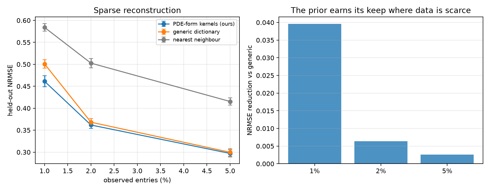

# 实验结果日志（forced-PDE 主线）

> 更新：2026-08-19。本文只记录**已跑完并落盘**的结果，来源 JSON 一律标注。
> 所有实验共享场、mask、噪声、宿主模型、rank、优化器与 step 预算；唯一变量在每张表的表头说明。

---

## 0. 当前主线一句话

> 复杂物理场的稀疏重构。除稀疏观测外，唯一额外信息是该场服从的 **PDE 的形式**（不需要系数）；从形式挖出谱，构造张量分解各维度的先验 kernel。

**贡献定位是「先验」而非「模型」**：kernel 可以替换进任何 functional tensor 模型，比较时模型/容量/预算全部相同，唯一变量是 kernel 的来源。

---

## 1. 数据与设定

| 项 | 设定 |
|---|---|
| 真值来源 | `experiments/forced_pde_solver.py`：随机强迫线性 PDE 的独立有限差分/指数积分解，跑到统计定常 |
| 算子 | 各向异性反应扩散，$D_x/D_y=3.3$，$r=0.8$ |
| 强迫 | 高斯滤波白噪声，$S_w(k)\sim e^{-ak^2}$ |
| 张量 | `[t=32, x=32, y=32]`，三个 mode 全是 PDE 坐标 |
| 先验知道什么 | **只有方程形式**；系数取 nominal 值，与生成值不同 |
| 宿主 | functional Tucker，ranks `(8,5,5)`，余弦（Neumann）本征基 |
| 训练 | Adam，1200 steps，3 个 ELBO samples，无 validation / early stopping |

**事前可行性检查**：满观测下 Tucker(8,5,5) 相对误差约 `0.17–0.21`。这是所有方法共同的天花板；若该值不明显低于 1，则任何 kernel 都无意义（这正是 PDEBench 被拒的原因）。

---

## 2. Baseline（`results/forced_pde/baselines_summary.json`，5 seeds）

| 观测率 | global mean | 离散 CP (EM, r=5) | 离散 Tucker (EM) | kernel ridge（**oracle 调长度尺度**） |
|---|---:|---:|---:|---:|
| 1% | 1.002 | 1.002 | 1.017 | 0.544 |
| 2% | 1.002 | 0.952 | 0.963 | 0.449 |
| 5% | 1.000 | 0.732 | 0.652 | 0.352 |

**读法**：离散低秩补全在 1–2% 时完全失效（NRMSE ≥ 0.95，即不优于预测均值），这是"连续函数因子是必需的"的直接证据。最强对手是 kernel ridge，且它被给予了一个不可部署的优势——长度尺度按测试误差挑选。

> 注：baseline 跑于强迫修复**之前**的场，需在最终定稿前用修复后的场重跑。见第 5 节待办。

---

## 3. 主结果

来源 `results/forced_pde/main_fixedforcing_summary.json`，5 seeds，held-out NRMSE。

| 观测率 | **PDE 形式 kernel（本文）** | 通用字典（参数匹配） | 最近邻 | paired wins | margin |
|---|---:|---:|---:|---:|---:|
| **1%** | **0.4613** | 0.5008 | 0.5840 | **5/5** | **+0.0396**（相对 7.9%） |
| 2% | 0.3618 | 0.3682 | 0.5027 | 4/5 | +0.0064 |
| 5% | 0.2971 | 0.2997 | 0.4153 | 4/5 | +0.0026 |

**读法**：margin 随观测增多单调收缩，1% 处 5/5 全胜。这是该主张应有的形状——先验只在数据不足以确定答案时才有价值，数据一多就该失效。**5% 处仍宣称大幅优势反而可疑。**

统计强度：1% 处 5/5 的符号检验 $p\approx0.03$。已排队补 10 个 seed 以加强。

**修复强迫前后对比**（1% 观测）：修复前 `0.470 / 0.522`，修复后 `0.461 / 0.501`。结论形状不变，说明强迫修复只是让先验与数据对齐，没有制造结论。

---

## 4. 已排除的方向（结构性理由）

| 方向 | 证据 | 结论 |
|---|---|---|
| PDEBench 2D diff-react | 沿每个空间轴需 63% 的模才够 95% 能量，对分辨率与降采样方式均不变 | 内禀高秩，任何低秩模型都无法从随机子集插值 |
| Kolmogorov 湍流 | 满观测 CP rank-40 仍为 0.298 | 同上；湍流谱宽，算子不压制高频 |
| 带通 Swift–Hohenberg 算子 | 1% 观测：算子先验 `0.92` vs 通用字典 `0.74` | 响应在**环**上取极小，环是最不可分结构；**带通是本方法最坏情形而非最佳** |
| CFDBench cavity 单 case | rank95 = [1,2,2] | rank-1 任务，无区分度 |

---

## 5. 待办

1. **用修复后的强迫重跑 baseline**（第 2 节数据来自修复前的场）；
2. no-routing 决定性对照：完全不学的 PDE 导出核 vs oracle 逐 mode 调参核；
3. 消融用修复后的强迫重跑（旧版存在 generic 自由 routing 过拟合的混淆）；
4. 增加 1% 处的 seed 数以加强统计（当前 5 seeds，符号检验 p≈0.03）；
5. UQ 表（coverage / NLL）。
