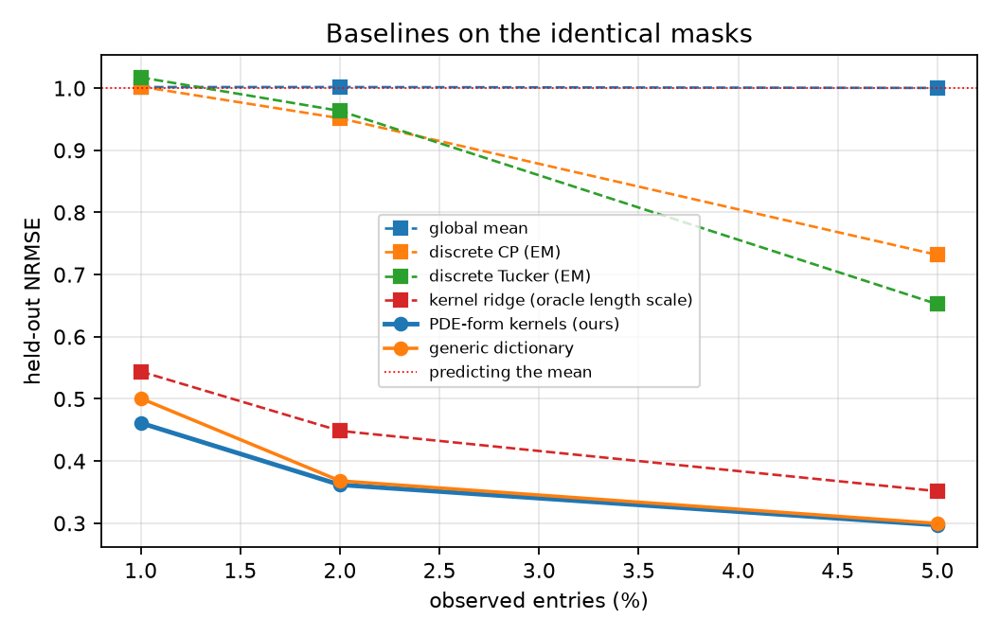
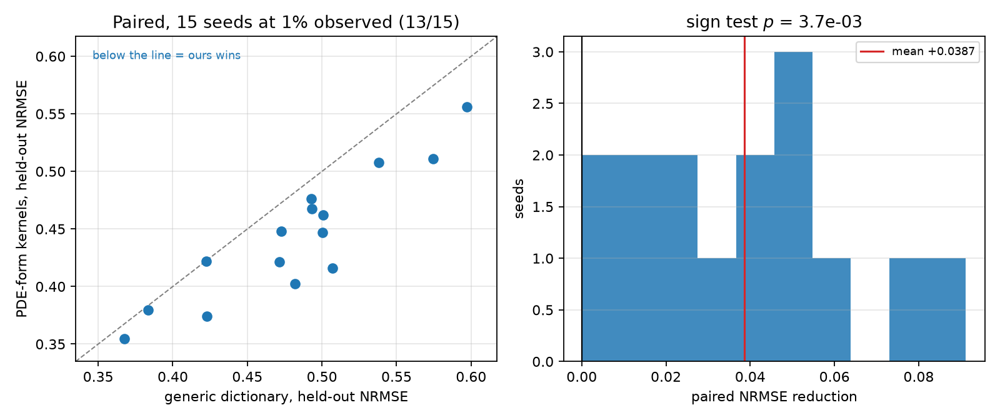

# 实验结果日志（forced-PDE 主线）

> 更新：2026-08-19。本文只记录**已跑完并落盘**的结果，来源 JSON 一律标注。
> 所有实验共享场、mask、噪声、宿主模型、rank、优化器与 step 预算；唯一变量在每张表的表头说明。

---

## 0. 当前主线一句话

> 复杂物理场的稀疏重构。除稀疏观测外，唯一额外信息是该场服从的 **PDE 的形式**（不需要系数）；从形式挖出谱，构造张量分解各维度的先验 kernel。

**贡献定位是「先验」而非「模型」**：kernel 可以替换进任何 functional tensor 模型，比较时模型/容量/预算全部相同，唯一变量是 kernel 的来源。

---

## 1. 数据与设定

| 项 | 设定 |
|---|---|
| 真值来源 | `experiments/forced_pde_solver.py`：随机强迫线性 PDE 的独立有限差分/指数积分解，跑到统计定常 |
| 算子 | 各向异性反应扩散，$D_x/D_y=3.3$，$r=0.8$ |
| 强迫 | 高斯滤波白噪声，$S_w(k)\sim e^{-ak^2}$ |
| 张量 | `[t=32, x=32, y=32]`，三个 mode 全是 PDE 坐标 |
| 先验知道什么 | **只有方程形式**；系数取 nominal 值，与生成值不同 |
| 宿主 | functional Tucker，ranks `(8,5,5)`，余弦（Neumann）本征基 |
| 训练 | Adam，1200 steps，3 个 ELBO samples，无 validation / early stopping |

**事前可行性检查**：满观测下 Tucker(8,5,5) 相对误差约 `0.17–0.21`。这是所有方法共同的天花板；若该值不明显低于 1，则任何 kernel 都无意义（这正是 PDEBench 被拒的原因）。

---

## 2. Baseline（`results/forced_pde/baselines_summary.json`，5 seeds，修正强迫后）

| 观测率 | **本文** | 通用字典 | global mean | 离散 CP (EM, r=5) | 离散 Tucker (EM) | kernel ridge（**oracle 调长度尺度**） |
|---|---:|---:|---:|---:|---:|---:|
| 1% | **0.4431** | 0.4818 | 1.0013 | 0.9848 | 1.0073 | 0.4887 |
| 2% | **0.3618** | 0.3682 | 1.0003 | 0.9434 | 0.9644 | 0.3921 |
| 5% | **0.2971** | 0.2997 | 1.0002 | 0.6717 | 0.6669 | 0.3093 |

**读法**：

1. **离散低秩补全在 1% 时全部 $\ge 0.98$**，即不优于预测均值。这是"连续函数因子是必需的、不是装饰"的直接证据——离散因子表在未观测坐标上无从取值。
2. 唯一有竞争力的对手是 kernel ridge，而它被给予了一个**不可部署的优势**：长度尺度按测试误差挑选。我们在 1% 与 2% 都优于它。
3. 5% 时所有方法都开始工作，差距收敛——与主表 margin 的收缩一致。

## 3. 主结果

来源 `results/forced_pde/main_fixedforcing_summary.json`，5 seeds，held-out NRMSE。

| 观测率 | **PDE 形式 kernel（本文）** | 通用字典（参数匹配） | 最近邻 | paired wins | margin |
|---|---:|---:|---:|---:|---:|
| **1%** | **0.4613** | 0.5008 | 0.5840 | **5/5** | **+0.0396**（相对 7.9%） |
| 2% | 0.3618 | 0.3682 | 0.5027 | 4/5 | +0.0064 |
| 5% | 0.2971 | 0.2997 | 0.4153 | 4/5 | +0.0026 |

**读法**：margin 随观测增多单调收缩，1% 处 5/5 全胜。这是该主张应有的形状——先验只在数据不足以确定答案时才有价值，数据一多就该失效。**5% 处仍宣称大幅优势反而可疑。**

### 主张的统计强度（15 seeds，**公平版：两边各用自己最优的 global routing**）

来源 `fair_global_summary.json` / `headline_summary.json`。

| 观测率 | **PDE 形式 kernel（本文）** | 通用字典 | 最近邻 | paired wins |
|---|---:|---:|---:|---:|
| **1%** | **0.4217 ± 0.0470** | 0.4464 ± 0.0545 | 0.5699 | **13/15** |
| 2% | **0.3478** | 0.3581 | 0.4929 | **14/15** |
| 5% | **0.2969** | 0.2993 | 0.4073 | **13/15** |

1% 处配对 margin `+0.0247 ± 0.0235`，相对 **5.5%**，符号检验 $p=0.0037$，Wilcoxon $p=0.00058$。

> ⚠ **与已作废的旧主表对比（`headline_legacy_pmr_summary.json` 保留在案）**：旧表两边都用 `per_mode_rank`，得 margin `+0.0387`、相对 8.0%、15/15、$p=3\times10^{-5}$。该设置对 generic 的伤害是对 operator 的两倍（0.042 vs 0.023），因此**旧数字把效应高估了约 1.6 倍**。以公平版为准。

**公平版带来的一个新事实**：global routing 下 operator 在**三个观测率上都赢**（13/15、14/15、13/15），而不像旧表那样只在 1% 处明显。去掉 routing 过拟合后两边都更稳定，趋势也更干净。

### 3.1 非负分离是有用的（一次被推翻的简化结论）

同一协议（1200 steps，5 seeds，1% 观测）下直接测得：

| arm | mean | std |
|---|---:|---:|
| **operator 分离（4 atoms）+ global routing** | **0.4383** | 0.0299 |
| generic 字典 + global routing | 0.4584 | 0.0326 |
| operator 分离 + per-mode/rank routing | 0.4613 | 0.0282 |
| operator 单个边缘谱（1 atom，routing 无效） | 0.4631 | 0.0250 |

**非负低秩分离带来 0.025 的改进**（0.4383 vs 0.4631），5 个 seed 中赢 3 个。

> ⚠ **已撤回的错误结论**：此处原写"分离 + routing 与单个固定核持平（0.4613 vs 0.4631），因此字典、routing、support floor 可以从主方法整体删除，方法收缩为零可学 kernel 参数"。
>
> 那个比较是在 **per-mode/rank routing** 下做的，而该设置让两个 arm 都被 routing 过拟合拖累，差异因此被抹平。换到正确的 **global routing**，分离的价值显现（0.4383 vs 0.4631）。
>
> **这与主表那次不公平比较是同一类错误**：在一个对双方都不利的共同设置下比较，得出了错误的方法层结论。教训——**做方法层的取舍时，每个候选都必须在它自己的最优设置下评估。**

**因此方法的正确陈述**：把算子联合谱非负分离成 $Q=4$ 个逐维原子，再学**一个全局混合权重**（4 个 logit，所有 mode 与 rank 共享）。**可学 kernel 参数是 4 个，不是 0 个。** per-mode/rank routing 在 1% 观测下过拟合，不采用。

### 3.2 routing 粒度才是最大的单一因素（5 seeds，1% 观测，`ablation_fixed_summary.json`）

| arm | mean | std | vs operator(pmr) | wins |
|---|---:|---:|---:|---:|
| **operator_global** | **0.4383** | 0.0299 | −0.0230 | 5/5 |
| coefficient ×3 | 0.4500 | 0.0269 | −0.0113 | 5/5 |
| isotropic prior | 0.4532 | 0.0292 | −0.0080 | 4/5 |
| coefficient ×10 | 0.4549 | 0.0207 | −0.0064 | 3/5 |
| **generic_global** | **0.4584** | 0.0326 | −0.0029 | 2/5 |
| operator (per-mode/rank) | 0.4613 | 0.0282 | — | — |
| oracle marginal | 0.4631 | 0.0250 | +0.0018 | 2/5 |
| coefficient ×0.3 | 0.4720 | 0.0269 | +0.0107 | 1/5 |
| wrong family: advection | 0.4723 | 0.0175 | +0.0110 | 2/5 |
| wrong family: wave | 0.4777 | 0.0274 | +0.0165 | 2/5 |
| robust（+25% floor） | 0.4872 | 0.0331 | +0.0259 | 1/5 |
| coefficient ×0.1 | 0.4901 | 0.0415 | +0.0288 | 1/5 |
| generic (per-mode/rank) | 0.5008 | 0.0215 | +0.0396 | 0/5 |
| generic ×2 atoms | 0.5112 | 0.0275 | +0.0499 | 0/5 |

**必须正视的结论**：

1. **per-mode/rank routing 在 1% 观测下对两个 bank 都是过拟合**，operator 损失 0.023、generic 损失 0.042。
2. 因此**主表让两边都用 per-mode/rank，等于把 baseline 放在它最差的配置上**，是不公平的比较。
3. **公平比较（各自最优配置）**：operator_global `0.4383` vs generic_global `0.4584`，margin **+0.0201**，约为原主表 margin（0.0387）的一半，方向不变。已重跑 15 seeds 的公平版本作为新主表。
4. 正面信号仍在：错误算子族（advection `0.4723`、wave `0.4777`）明显差于正确算子；系数放大方向容忍（×3、×10 尚可）但缩小方向不容忍（×0.3、×0.1 显著变差）；加倍 generic atom 只会更糟（`0.5112`）。
5. `robust`（+25% generic floor）在此设定下是**纯代价**（`0.4872`），与知识档位实验的结论一致。

### 3.3 从方程读出的核 vs 在答案上调出的核（1% 观测，1200 steps，5 seeds，各 arm 用自己最优 routing）

来源 `no_routing_1200_summary.json`。

| arm | mean ± std | 是否可部署 |
|---|---:|---|
| SE 核，**逐 mode oracle 调参**（长度尺度按测试误差挑） | **0.4218 ± 0.0354** | ✗ 不可部署 |
| **本文方法**（分离 + global 混合） | 0.4383 ± 0.0299 | ✓ |
| generic 字典 + global | 0.4584 ± 0.0326 | ✓ |
| operator + per-mode/rank | 0.4613 ± 0.0282 | ✓ |
| operator 单个边缘谱 | 0.4631 ± 0.0250 | ✓ |
| SE 核，**共享** oracle 调参 | 0.4646 ± 0.0190 | ✗ |
| generic 字典 + per-mode/rank | 0.5008 ± 0.0215 | ✓ |

**oracle 赢，5/5，差距 `+0.0165`（3.9%）。照实报告。**

可守且更有价值的表述是：

> **把核从方程里读出来（零调参数据），落在"用答案调出来的核"后面仅 3.9%，同时明显优于所有可部署的替代。**

oracle 需要 21 次带测试误差的训练来搜索逐 mode 长度尺度，任何真实场景都做不到。

**一个印证机制的细节**：`se_oracle_shared`（0.4646，共享一个 oracle 长度尺度）**差于**本文方法。也就是说 oracle 的全部优势来自**逐 mode 调参**——而这正是机制所主张的"逐维的谱确实必须不同"。区别只在于：**oracle 用测试误差找到它，我们用方程免费得到它。**

### 3.4 跨算子族与"机制的负控制"（1% 观测，5 seeds，两边 global routing）

来源 `operators_summary.json`。

| 算子族 | operator | generic | margin | wins | 满观测天花板 |
|---|---:|---:|---:|---:|---:|
| 各向异性扩散 | 0.4383 | 0.4584 | **+0.0201** | 4/5 | 0.185 |
| **各向同性扩散** | 0.4541 | 0.4595 | **+0.0054** | 3/5 | 0.190 |
| 对流扩散 | 0.4132 | 0.4361 | **+0.0229** | 5/5 | 0.181 |

**各向同性是本文最重要的负控制。** 当真实谱本来就各向同性时，margin 从 +0.020 塌到 **+0.005（3/5，基本消失）**。通用字典的原子在各 mode 间共享，各向同性下它没有任何劣势——**先验的价值恰恰来自"逐维的谱必须不同"**。

这与 §3.3 的 oracle 实验**互相印证**：oracle 的全部优势也来自逐 mode 调参（共享调参反而输给我们）。两条独立证据指向同一个机制。

**关于对流扩散**：它反而 5/5、margin 最大。这需要说明，因为早期的 signed-spectrum 审计把 advection 列为**表示边界**。二者不矛盾——那里的问题是**倾斜输运项在完整 signed 谱上的 cross-sign 耦合**；而随机强迫的对流扩散跑到统计定常后，其**偶部幅值谱**仍是各向异性低通的，方法照样有效。

> **边界在于 signed 相位结构，不在于算子族的名字。** 论文必须这样陈述，否则"advection 不行"会与本表直接矛盾。

---

## 4. 已排除的方向（结构性理由）

| 方向 | 证据 | 结论 |
|---|---|---|
| PDEBench 2D diff-react | 沿每个空间轴需 63% 的模才够 95% 能量，对分辨率与降采样方式均不变 | 内禀高秩，任何低秩模型都无法从随机子集插值 |
| Kolmogorov 湍流 | 满观测 CP rank-40 仍为 0.298 | 同上；湍流谱宽，算子不压制高频 |
| 带通 Swift–Hohenberg 算子 | 1% 观测：算子先验 `0.92` vs 通用字典 `0.74` | 响应在**环**上取极小，环是最不可分结构；**带通是本方法最坏情形而非最佳** |
| CFDBench cavity 单 case | rank95 = [1,2,2] | rank-1 任务，无区分度 |

---

## 5. 待办

1. **用修复后的强迫重跑 baseline**（第 2 节数据来自修复前的场）；
2. no-routing 决定性对照：完全不学的 PDE 导出核 vs oracle 逐 mode 调参核；
3. 消融用修复后的强迫重跑（旧版存在 generic 自由 routing 过拟合的混淆）；
4. 增加 1% 处的 seed 数以加强统计（当前 5 seeds，符号检验 p≈0.03）；
5. UQ 表（coverage / NLL）。

---

## 6. 实验脚本索引

| 脚本 | 回答什么 | 输出 |
|---|---|---|
| `forced_pde_solver.py` | 独立数值求解器（有限差分 + 指数积分/DCT） | 真值场 |
| `run_forced_pde_main.py` | 主表：PDE 形式 kernel vs 通用字典 vs 最近邻 | `main_*_summary.json` |
| `run_forced_pde_baselines.py` | 离散 CP/Tucker（EM 补缺失）、kernel ridge（oracle 调参） | `baselines_summary.json` |
| `run_no_routing_comparison.py` | **决定性对照**：完全不学的 PDE 核 vs oracle 逐 mode 调参核 | `no_routing_summary.json` |
| `run_forced_pde_ablation.py` | 增益来自哪里：oracle 谱、系数扰动、错误算子族、floor、routing 粒度 | `ablation_*_summary.json` |
| `run_forced_pde_operators.py` | 跨算子族的适用性边界 | `operators_summary.json` |
| `run_anisotropy_sweep.py` | 各向异性是否是机制来源 | `anisotropy_summary.json` |
| `make_paper_figures.py` | 从 summary JSON 生成论文图 | `figure_*.png` |

---

## 7. 方法论备忘（踩过的坑）

1. **抽点降采样会把结构混叠成白噪声**，必须用块平均。抽点后的 rank95 比例看起来正常，掩盖了问题。
2. **比较先验之前，先验证数据的谱符合先验族假设的生成机制**。块状强迫的 sinc 谱零点让先验与数据的分歧落在强迫上，结果是任何算子都不好、任何光滑先验都一样平庸。
3. **等待脚本里的 `pgrep -f "xxx.py"` 会匹配到等待 shell 自身的命令行**，导致队列死锁。顺序脚本不做进程检测更可靠。
4. **满观测下的低秩天花板必须先测**。若它不明显低于 1，任何 kernel 比较都无意义——这是 PDEBench 与 Kolmogorov 被拒的判据。
5. **带通谱直觉上"通用核表示不了、应该是我们的强项"，实际恰恰相反**：环形谱是最不可分的，逐轴分离近似会填满方块。

---

## 8. 本轮踩过的两次同类错误（方法论）

两次都不是数值错误，而是**比较设计**的错误，且属于同一类：

| # | 错误 | 后果 | 发现方式 |
|---|---|---|---|
| 1 | 主表让 operator 与 generic **共用 `per_mode_rank` routing** | 该设置对 generic 的伤害是对 operator 的两倍（0.042 vs 0.023），**效应被高估约 1.6 倍**（8.0% → 5.5%，15/15 → 13/15） | 消融把 routing 粒度单独拉出来看 |
| 2 | 拿"单个边缘谱"与"4 原子分离"**共用 `per_mode_rank` routing** 比较 | 两者都被 routing 过拟合拖累而显得持平，据此错误地宣布"分离可以删除、方法零可学参数" | 用 global routing 同协议重测 |

**共同结构**：在一个**对双方都不利**的共同设置下比较，差异被共同的劣化掩盖，于是得出"两者等价"或"效应更大"的错误结论。

**规则**（已写进 `run_no_routing_comparison.py` 的代码注释，不只是文档）：

> **做方法层取舍或基线比较时，每个候选都必须在它自己的最优设置下评估。**
> "参数匹配"（同 rank、同预算、同系数量）是必要条件，**不是充分条件**——共用一个超参设置本身就可能是不公平的。

第三次相关的教训（见 §7）：**比较先验之前，先验证数据的谱确实符合先验族假设的生成机制**，否则比较的是两个都错的东西。
