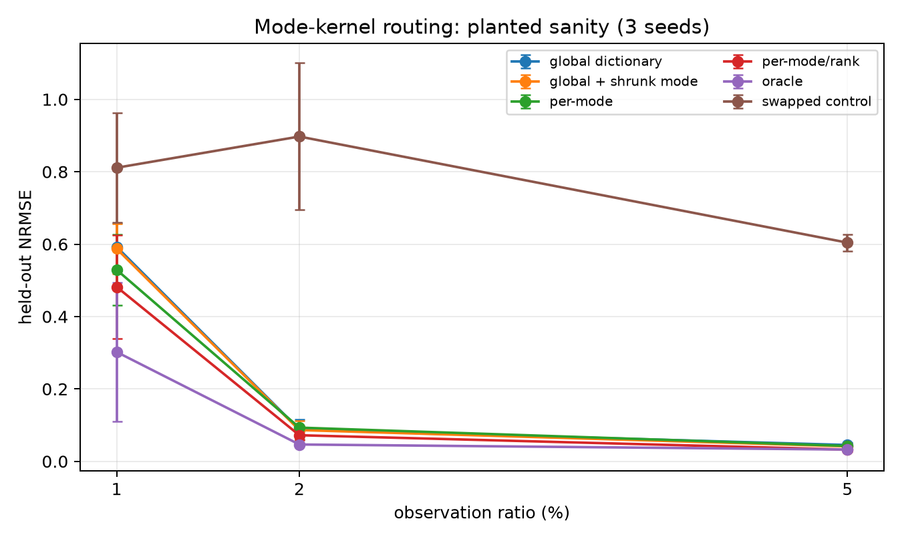
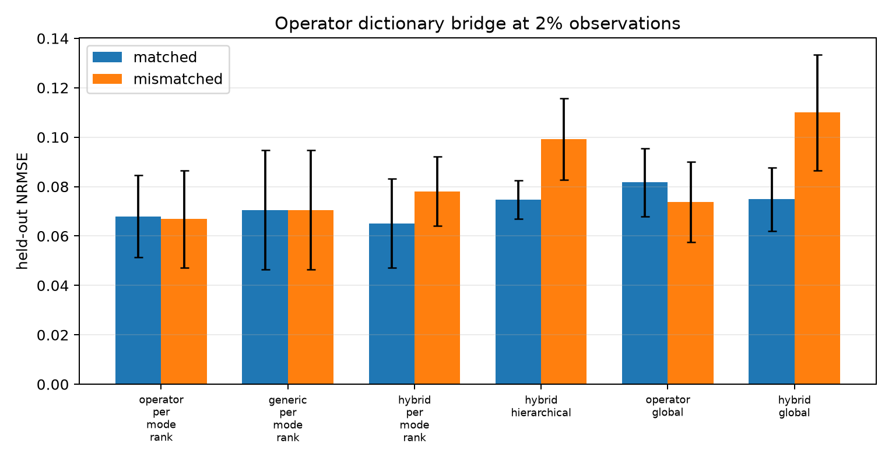

# 方向 3 技术报告：Operator-Spectral FunBaT

> 论文级的简洁 Introduction + Related Work + Method 已独立整理在 [`PAPER_TECHNICAL_REPORT_ZH.md`](PAPER_TECHNICAL_REPORT_ZH.md)。本文件保留 2026-08-15 expanded-feature POC 和更早 domain-kernel 支线的完整历史，不能与新的 collapsed 公平确认结果混表。

> 独立仓库高级 POC 状态（2026-08-15）：青基申请书中的“算子联合功率谱 → 非负可分离谱 → 各 mode/rank GP 核 → functional tensor likelihood”已完整实现，并完成 3 seeds、400 steps、1%/2%/5% 观测率的五轮机制实验。结论是 **数学链条与预测机制成立，但从极稀疏数据恢复具体 kernel atom 并不可识别**。最合理的新方法不是放弃已有 kernel dictionary，而是将 operator-derived atoms 与通用 dictionary 组成带安全兜底的混合先验。

## A. 当前最简故事

普通 FunBaT 为每个连续 mode 的因子指定通用 Matérn/RBF GP。青基本子的关键提升是：如果物理场满足

\[
\mathcal L u=w,
\]

先由算子频率响应构造联合物理谱

\[
S_{\rm phys}(\omega_x,\omega_y,\omega_t)
=|\widehat{\mathcal L}(\boldsymbol\omega)|^{-2}S_w(\boldsymbol\omega),
\]

再作非负低秩分离

\[
S_{\rm phys}\approx
\sum_{q=1}^{Q}\lambda_q
s_{xq}(\omega_x)s_{yq}(\omega_y)s_{tq}(\omega_t),
\qquad \lambda_q,s_{dq}\geq0.
\]

每个非负一维谱通过 Wiener--Khinchin 对应一个合法 GP kernel。不同 tensor mode/rank 再选择不同 kernel：

\[
k_{dr}=\sum_q \pi_{drq}k_{dq},\qquad
\pi_{drq}\geq0,\quad\sum_q\pi_{drq}=1.
\]

最后使用 functional CP likelihood：

\[
y(x,y,t)=\sum_{r=1}^{R}c_r
f_{xr}(x)f_{yr}(y)f_{tr}(t)+\epsilon.
\]

当前先采用 CP 而不是 dense Tucker core，因为它能最直接地判断收益是否来自 mode-wise kernel，而不是额外 core 参数。若该机制在更真实数据上成立，再替换为小 Tucker core 并不困难。

## B. 可审计实现

实现文件为 `src/geoaware/operator_spectral_funbat.py`。

1. `operator_joint_spectrum` 分别实现 anisotropic diffusion、damped wave 和 advection--diffusion 的 $|\widehat L|^{-2}S_w$。
2. `nonnegative_cp_spectrum` 用非负 CP 将三维联合谱投影为一维 mode spectra。
3. `fourier_features` 将每个非负单边谱 $s_q$ 转换成

   \[
   \phi_q(x)=\left[\sqrt{s_q(0)},
   \sqrt{2s_q(k)}\cos 2\pi kx,
   \sqrt{2s_q(k)}\sin 2\pi kx\right]_{k=1}^{K}.
   \]

   因而 $k_q(x,x')=\phi_q(x)^\top\phi_q(x')$ 必然半正定。混合特征使用 $\sqrt{\pi_{drq}}\phi_q$，所以任意学习到的 routing 也保持 PSD。
4. 每个 Fourier coefficient 使用 mean-field Gaussian $q(a)=\mathcal N(\mu,\operatorname{diag}\sigma^2)$；训练目标是 Monte-Carlo Gaussian ELBO：

   \[
   \mathcal L=\mathbb E_q[\log p(y\mid f_x,f_y,f_t,c)]
   -\sum_{d,r}\operatorname{KL}[q(a_{dr})\|\mathcal N(0,I)].
   \]

5. `global`、`per_mode`、`per_mode_rank`、`oracle`、`swap` 使用完全相同的 feature budget、rank、噪声、mask 和 400-step 预算。

层级折中版本使用

\[
\pi_{dq}=\operatorname{softmax}(g_q+\Delta_{dq}),
\qquad \Delta_{dq}\sim\mathcal N(0,0.35^2),
\]

并把前 100 steps 固定为 global warm start、后 300 steps 才释放 mode deviation。它是“简单字典与高级 routing”的最小桥，而不是额外网络。

## C. 五轮实验

### R1：不同 mode/rank 使用不同 kernel 的 planted sanity

- 数据：$24^3$ 连续坐标张量，rank 2；smooth、Matérn、oscillatory、broadband 四种谱。
- 真值的 $x/y/t$ mode 和两个 rank 使用不同 kernel。
- 观测率：1%、2%、5%；噪声标准差 0.05；3 seeds。
- 每个 seed 的非观测条目全部作为 test；没有 validation、early stopping 或 test 调参。

| 方法 | 1% NRMSE | 2% NRMSE | 5% NRMSE |
|---|---:|---:|---:|
| global dictionary | 0.593±0.066 | 0.088±0.027 | 0.045±0.007 |
| global + shrunk mode | 0.587±0.069 | 0.086±0.025 | 0.041±0.006 |
| per-mode | 0.529±0.099 | 0.093±0.004 | 0.043±0.008 |
| per-mode/rank | **0.482±0.143** | 0.072±0.013 | **0.033±0.005** |
| oracle route | 0.302±0.192 | **0.047±0.005** | 0.033±0.001 |
| swapped route | 0.811±0.152 | 0.897±0.203 | 0.604±0.023 |

正信号：正确 mode/rank kernel 确实显著改变极稀疏样本效率；2% 的 oracle 比 global 误差降低约 47%，错误交换 route 明显失败。5% 时 learned per-mode/rank 已追平 oracle。

### R2：预测有效不等于 kernel atom 可识别

per-mode/rank 的 atom top-1 recovery 只有 22%--33%。即使 5% 预测误差达到 0.033，top-1 也没有恢复。这并不矛盾：四个 atom 共享有限 Fourier support，彼此高度相关；变分 coefficient 也可以补偿 prior amplitude。

因此论文不得把 softmax argmax 解释成“发现了真实 PDE kernel”。本仓库额外报告 induced prior spectrum 的 cosine/L2，而不只报告 atom label。当前 learned spectrum cosine 约 0.60--0.77，oracle 为 1，swap 仅 0.382。**当前证据支持预测归纳偏置，不支持参数识别。**

### R3：PDE 联合谱是否能低秩分离

| operator | rank 1 error | rank 4 error | rank 6 error |
|---|---:|---:|---:|
| anisotropic diffusion | 0.0619 | **0.0028** | 0.0016 |
| advection--diffusion | 0.2374 | **0.0325** | 0.0122 |
| damped wave | 0.4044 | **0.1079** | 0.0974 |

扩散和输运联合谱能用很低的非负 rank 逼近；波动谱的倾斜 dispersion surface 难以轴向分离，是明确负信号。这给方法适用范围一个可测量指标：operator spectrum separability，而不是泛称“任何 PDE 都适用”。

### R4：operator atoms 与通用 kernel dictionary 的平衡

在 operator-planted advection 数据、2% observation 下：

| 方法 | NRMSE |
|---|---:|
| operator global | 0.0817±0.0137 |
| generic per-mode/rank | 0.0706±0.0240 |
| operator per-mode/rank | 0.0679±0.0166 |
| operator + generic hybrid per-mode/rank | **0.0651±0.0180** |
| hybrid hierarchical | 0.0747±0.0078 |

hybrid 有小幅最好均值，但优势不足以单独构成论文证据。层级 shrinkage 方差较小，却没有超过自由 per-mode/rank；它是稳定 baseline，不是当前 winner。

### R5：mismatch 与安全兜底

只把 advection prior 换为 diffusion prior 时误差没有明显恶化。原因不是模型识别了正确 PDE，而是两个 finite-spectrum prior 具有相同 Fourier support，likelihood 可以通过 coefficient posterior 补偿谱幅值失配。

更严格的 spectral-support mismatch 把 prior 中 $k\geq2$ 的频率删除：

| 失配控制 | NRMSE |
|---|---:|
| wrong-support operator only | 0.631±0.141 |
| wrong-support operator + generic dictionary | **0.068±0.018** |

这给出了最有价值的折中：operator atoms 提供物理偏置，generic atoms 是 prior misspecification 的安全网。它比“从一个字典里任意选核”更有物理来源，也比完全相信解析算子核更稳健。

## D. 当前推荐论文方法

推荐暂定为 **Operator-Spectral FunBaT with a Robust Kernel Bank**：

1. 用已知/近似 PDE 构造 joint operator spectrum；
2. 用非负谱分离得到有物理解释且 PSD 的 mode atoms；
3. 与少量 generic smooth/oscillatory atoms 合并；
4. 用 ELBO 学习 per-mode 或 per-mode/rank 的 soft routing；
5. 用 operator-centered Dirichlet/logit prior 约束 routing，但始终保留 generic escape mass；
6. 把 prediction、induced covariance recovery、uncertainty calibration 分开报告。

不建议当前声称“自动发现每个维度的真实 kernel”。更准确的主张是：**将不可分的算子联合谱投影为低秩、合法的 mode-wise GP prior，并在模型失配时通过通用谱库进行稳健修正。**

## E. 与官方代码的借鉴边界

- [FunBaT 官方实现](https://github.com/xuangu-fang/Functional-Bayesian-Tucker-Decomposition)提供逐 mode GP 因子和 functional CP/Tucker 的出发点。其 SDE/message passing 代码没有搬入本仓库；本 POC 使用有限 Fourier posterior，是为了先隔离 kernel-routing 机制。
- [高频 GP 官方实现](https://github.com/xuangu-fang/Gaussian-Process-Slover-for-High-Freq-PDE)中的 `SE/Matern × cosine` 说明非负频谱混合可以表达高频/多尺度场。本仓库没有搬入其 JAX PDE residual solver，只复用了“正谱权重 + cosine features”的数学结构。
- [LinPDE-GP](https://github.com/marvinpfoertner/linpde-gp)用于核对线性算子作用于 GP 的语义边界；本方法当前不是 probabilistic PDE solver，也没有把 PDE residual 放进 likelihood。

## F. 结果与复现入口

- 主实验：`experiments/run_operator_spectral_poc.py`
- 层级桥：`experiments/run_hierarchical_bridge.py`
- 支撑集失配：`experiments/run_support_mismatch_control.py`
- 汇总/绘图：`experiments/analyze_operator_spectral_poc.py`
- raw JSON、summary 和图：`results/advanced_poc_r1_r5/`
- 单元测试：PSD、unit diagonal、非负谱分离、routing gradient、ELBO shape、hierarchical shrinkage。

---

以下保留拆库前的 domain-kernel dictionary 报告，作为 Stage-0 基线和历史证据。

> 状态（2026-08-15 R4 更新）：**显式 finite-feature variational GP、四类几何 kernel dictionary 和 ELBO 学习的非负 kernel mixture 均已实现。** 方法友好的 matched/near-matched sanity 为强正信号；现有 elliptic 数据上，纯 GP mixture 有小幅收益，但 neural tensor + GP residual 的三 seed 收益不稳定。因此当前结论是“kernel selection 机制跑通，真实 PDE 泛化仍为条件 GO”，不是已经完成 Bayesian functional Tucker。

## 0. 先给结论

这个方向最简洁的研究问题是：

> 在不规则边界、孔洞和变化网格上，能否把欧氏空间中的 GP functional Tucker，替换为定义在物理域本身上的 GP functional Tucker，从而同时获得稀疏观测下的几何归纳偏置、跨分辨率预测和可信不确定性？

当前证据支持较弱但明确的第一步：在相同 Tucker 网络中，把以欧氏距离构造的 RBF sections 换成由不规则域 Laplacian 构造的 intrinsic sections，在未见形状、24→32 跨分辨率、1% 训练条目条件下，三 seed 验证误差从 `0.3320` 降到 `0.2602`；加入相同局部坐标/SDF 后，两者分别为 `0.2031` 与 `0.1905`，边界误差分别为 `0.2267` 与 `0.1905`。

新完成的两组三-seed ELBO 实验修正了故事：纯 35 维 finite-feature GP 的点预测 NRMSE 约为 `0.32`，明显弱于 neural model；但把相同 GP 作为共享 neural CP mean 的 residual 后，intrinsic 版本从 mean-only 的 `0.2036` 改善到 `0.1765`，三个 seed 均改善，且显著优于参数匹配的 Euclidean residual `0.2280`。因此现在最值得推进的是 **neural tensor mean + domain-GP residual**，不是纯 GP，也暂时不是更复杂的全 Bayesian Tucker。

## 1. 四条线中本方向的独立故事

方向 1 是已知算子基底上的有限参数 Bayesian Tucker，重点是强结构先验和极低观测率下的张量恢复。方向 3 不应只是把方向 1 改一个 kernel 名字；它应当回答另外三个问题：

1. 因子是连续函数，而不是某个固定网格上的 factor table；
2. 几何通过域上的 covariance/prior 进入，而不只是通过固定谱基；
3. 新域上的 posterior adaptation 和不确定性是论文贡献，而不是只给点预测。

因此建议标题暂定为：

**Domain-kernel Bayesian Functional Tucker for Sparse Fields on Irregular Domains**

最有价值的应用场景不是完全零样本的 PDE surrogate，而是：已有多个训练域，在一个新的不规则域上只拿到极少传感器或少量工况观测，需要恢复整个多模物理场并给出 uncertainty。完全零样本可以报告，但不应成为 GP 版本唯一任务，因为独立的零均值 domain GP 在新域没有观测时，其 posterior mean 必然回到零。

## 2. 数据对象与任务定义

令第 $c$ 个物理域为 $\Omega_c\subset\mathbb R^d$，它可以有不规则外边界和内部孔洞。一个观测写作

\[
\mathcal D=\{(c_i,s_i,a_i,x_i,y_i)\}_{i=1}^{N_{\rm obs}},
\]

其中：

- (s_i\in\Omega_{c_i})：源位置或激励位置；
- (a_i\in\mathcal A)：扩散系数、频率、Reynolds number 等工况参数；
- (x_i\in\Omega_{c_i})：查询点；
- (y_i=u_{c_i}(s_i,a_i,x_i)+\epsilon_i)：物理场值；
- $\epsilon_i\sim\mathcal N(0,\sigma^2)$。

当前合成数据的张量语义是 `[source, diffusivity, irregular-domain node]`，每个域有 4 个 source、14 个 diffusivity 和约 300–900 个 active nodes。

需要明确区分三种任务：

### 2.1 同域 tensor completion

训练和测试来自同一个 $\Omega_c$，只隐藏条目。这是最接近传统 tensor completion 的设置，也最适合与 CP/Tucker/FunBaT 公平比较。

### 2.2 新域 few-shot adaptation（主任务）

测试域在训练中从未出现，但允许观察测试域的 0.1%–5% 条目，再恢复其余条目。这里 domain kernel 的 posterior adaptation 和 UQ 才真正有用。

### 2.3 新域 zero-shot operator prediction

测试域完全没有目标观测，只给几何、source 和参数。这个任务需要共享的跨域 mean function 或 cross-domain covariance；仅有互相独立的 domain GP 不能完成 zero-shot transfer。

当前 POC 实际做的是第 2.3 类：1% 只施加在四个训练形状上，验证/测试新形状一个目标值也没有看到。因此现有实验不应描述为“在新域上用 1% 观测恢复”。

## 3. 投稿版本的严格 formulation

### 3.1 域上的 Matérn-like covariance

令 (L_{\Omega_c}) 为带指定边界条件的正半定 Laplacian，特征对满足

\[
L_{\Omega_c}\phi_{cj}=\lambda_{cj}\phi_{cj}.
\]

一个谱截断的 domain Matérn covariance 可写为

\[
k_{\Omega_c}(x,x';\kappa,\nu)
=\sigma_f^2\sum_{j=0}^{J-1}
(\kappa^2+\lambda_{cj})^{-(\nu+d/2)}
\phi_{cj}(x)\phi_{cj}(x').
\]

因为 covariance 使用 $\phi_j(x)\phi_j(x')$，单个 eigenvector 的任意正负翻转不会改变 kernel。孔洞和凹边界通过 $L_{\Omega_c}$ 改变传播关系；欧氏距离很近、但隔着孔洞或墙面的点，不再必然高度相关。

这里必须谨慎：Riemannian Matérn 的经典谱公式通常在紧致无边界 manifold 上陈述；本项目使用的是带 reflecting/Neumann 边界的离散 graph Laplacian。Neumann SPDE 会引入真实的边界 covariance effect。论文中必须把边界条件当作 prior 定义的一部分，并做 Dirichlet/Neumann/mismatched BC 消融，不能直接引用无边界结论后声称完全等价。

### 3.2 真正的 geometry-aware functional Tucker

最干净的三模模型是

\[
u_c(s,a,x)
=\sum_{p=1}^{R_s}\sum_{q=1}^{R_a}\sum_{r=1}^{R_x}
G_{pqr}\,F^{(s)}_{cp}(s)\,F^{(a)}_q(a)\,F^{(x)}_{cr}(x).
\]

为 source 和 spatial 因子使用同一个域 kernel：

\[
F^{(s)}_{cp}\sim\operatorname{GP}(m^{(s)}_{\theta,p},k_{\Omega_c}),\qquad
F^{(x)}_{cr}\sim\operatorname{GP}(m^{(x)}_{\theta,r},k_{\Omega_c}),
\]

参数因子可采用一维 Matérn/RBF GP：

\[
F^{(a)}_q\sim\operatorname{GP}(m^{(a)}_{\theta,q},k_a).
\]

小 core 使用

\[
\operatorname{vec}(G)\sim\mathcal N(0,\tau_G^{-1}I).
\]

共享 mean (m_\theta(c,x)) 由纯几何输入（坐标、SDF、工况和允许的 domain descriptor）产生。它承担 zero-shot transfer；domain GP residual 承担新域 few-shot adaptation、局部几何平滑和 uncertainty。若去掉共享 mean，不同域的 GP 独立，则测试域零观测时 posterior mean 为零，这是模型性质而不是训练技巧能解决的问题。

### 3.3 为什么 source 与 query 应分开

当前 POC 把 $k_{\Omega}(x,s)$、$x$、$s$ 一起送入一个 spatial MLP，因此严格说不是 source × parameter × space 的三模 Tucker。投稿模型应把 source factor 与 query factor 分开。对于线性 elliptic PDE，其 Green function 本身就有谱展开

\[
G_\Omega(x,s)\approx\sum_j \rho_j\phi_j(x)\phi_j(s),
\]

所以用共享 domain kernel prior 分别约束 source 和 spatial factors 既更符合张量故事，也更便于解释孔洞为何起作用。

## 4. 当前代码究竟实现了什么

当前实现位于：

- `src/geoaware/domain_kernels.py`
- `src/geoaware/variational_domain_gp.py`
- `src/geoaware/functional_tucker.py`
- `experiments/run_four_track_fast_poc.py`
- `experiments/track3_variational_domain_gp.py`
- `experiments/track3_neural_mean_gp_residual.py`

当前 intrinsic section 为

\[
z_{\Omega,q}(x,s)=\operatorname{RMSNorm}\left[
\frac1J\sum_{j=0}^{J-1}\phi_j(x)\phi_j(s)
(1+\alpha_q\lambda_j)^{-p}\right],
\]

其中 $J=48$、$\alpha_q\in\{0.03,0.1,0.3,1,3\}$、$p=1.5$。eigenvalue 先除以该图第一个正 eigenvalue，basis 又做 empirical-$L^2$ normalization，最后每个 section channel 按其自身 RMS 标准化。

这些操作对跨分辨率数值稳定很有帮助，但它们改变了 covariance amplitude，也没有学习 $\kappa,\nu,\sigma_f$。因此这些 section 应叫“由 covariance 启发的 geometry features”，不能当作已经校准的 GP covariance matrix。

点预测模型是

\[
\widehat y=\sum_{g,p,r} C_{gpr}
A_g(d_{\Omega}) B_p([\log a,a]) H_r(z),
\]

其中 (d_\Omega\in\mathbb R^7) 是手工 domain descriptor；纯 kernel 版本令 (z=z_\Omega(x,s))，当前默认版本令

\[
z=[z_\Omega(x,s),x,\operatorname{SDF}_\Omega(x),s,\|x-s\|,1].
\]

$A,B,H$ 都是两层 GELU MLP，使用 AdamW 训练。这个模型有显式 Tucker core，但它是**确定性 neural functional Tucker**。普通 weight decay 不是显式 GP coefficient prior；当前没有 posterior distribution。

### 4.1 “composite kernel”命名需要纠正

当前代码只是把 intrinsic sections 与局部坐标/SDF **拼接后送入非线性 MLP**。这不等于

\[
k_{\rm composite}=k_\Omega+k_{\rm local}
\quad\text{或}\quad
k_\Omega k_{\rm local}.
\]

本报告以后称它为 `intrinsic_plus_local_inputs`，而不是 additive/composite GP kernel。真正的 composite kernel 必须直接构造 PSD covariance，并在 GP/KRR posterior 中使用。

### 4.2 “topology-erased”消融当前并未真正抹掉 topology

旧配置 `topology_erased_kernel_tucker` 只把 intrinsic spectral sections 换成 rectangle/bounding-box sections，但仍然给模型正确的：

- SDF；
- query/source 坐标；
- 从真实 fluid mask、边界距离统计得到的 domain descriptor。

所以它只能解释为 **bbox-kernel channel ablation with correct local geometry metadata**。它不能支持“抹掉所有 topology 后显著变差”这一强结论。真正 topology-erased control 应同时去掉 SDF、hole/component count、真实 domain descriptor，并只保留 bounding box 坐标和 rectangle kernel。

## 5. inference 路线：从 POC 到完整 Bayesian 模型

### Stage 0：当前 deterministic feature POC

目标：先验证 intrinsic covariance feature 是否比欧氏 feature 更适合孔洞/凹边界。

- point estimate：AdamW；
- uncertainty：无；
- 可声称：geometry-feature mechanism POC；
- 不可声称：GP、MAP、Bayesian posterior、calibrated UQ。

### Stage 1：固定因子 + Bayesian core

给定确定性 factor features，单个 observation 对 core 是线性的。令

\[
a_i=F^{(s)}(s_i)\otimes F^{(a)}(a_i)\otimes F^{(x)}(x_i),
\]

则

\[
y_i=a_i^\top g+\epsilon_i,
\quad g=\operatorname{vec}(G).
\]

Gaussian prior 下可精确计算

\[
\Sigma_g^{-1}=\tau_G I+\sigma^{-2}A^\top A,
\qquad
\mu_g=\sigma^{-2}\Sigma_g A^\top y.
\]

这一步可以快速提供“conditional-on-features”的 uncertainty，但不是完整 GP uncertainty。它适合做推断单元测试，也可作为方向 1 与方向 3 之间的桥梁。

### Stage 2：单 GP residual mode 的真实 variational posterior

先只随机化 spatial factor：

\[
F^{(x)}_{cr}(x)=m_{\theta,r}(c,x)
+\Phi_c(x)\operatorname{diag}(\rho_c^{1/2})w_{cr},
\quad w_{cr}\sim\mathcal N(0,I),
\]

使用 whitened variational posterior

\[
q(w_{cr})=\mathcal N(\mu_{cr},S_{cr}).
\]

优化

\[
\mathcal L=
\sum_{i\in\mathcal O}\mathbb E_q[\log p(y_i\mid F,G)]
-\sum_{c,r}\operatorname{KL}[q(w_{cr})\|p(w_{cr})]
-\operatorname{KL}[q(G)\|p(G)].
\]

先用 diagonal (S)，通过 reparameterization Monte Carlo 训练。只有 Stage 2 完成后，代码才能诚实称为 approximate GP factor posterior。

### 本轮已完成的最小 Bayesian 闭环：有限核上的显式变分 GP

为了先把推理定义做对，本轮采用比 Stage 2 更小、可与 exact posterior 对齐的模型。对每个 observation 构造

\[
\phi(s,a,x)=D^{-1/2}\,z_\Omega(s,x)\otimes\psi(a)\in\mathbb R^{35},
\]

其中 \(z_\Omega\) 是 5 个 intrinsic Matérn sections 或参数完全匹配的 5 个 Euclidean RBF sections，\(\psi\) 是 7 个固定参数 RBF features。它定义合法有限秩 kernel

\[
k(\xi,\xi')=\phi(\xi)^\top\phi(\xi').
\]

白化的 inter-domain inducing coefficients 为

\[
p(u)=\mathcal N(0,I),\qquad
q(u)=\mathcal N(m,LL^\top).
\]

likelihood 为 \(p(y_i\mid u)=\mathcal N(\phi_i^\top u,\sigma_n^2)\)，训练目标是

\[
\mathcal L=
\frac{N}{|B|}\sum_{i\in B}
\mathbb E_{q(u)}\log p(y_i\mid u)
-\operatorname{KL}[q(u)\|p(u)].
\]

Gaussian expected log-likelihood 和 KL 都解析计算；使用 Adam mini-batch SGD，500 steps。因为只有 35 个 latent coefficients，还同时计算同一 kernel、同一 learned noise 下的闭式 exact posterior。这一实现可以严格称为 finite-feature variational GP，但还没有 Tucker core，也没有 neural mean。

严格地说，这里的 GP covariance 是 **domain-kernel sections 的 inner-product kernel**，不是直接把原始 \(k_\Omega(x,x')\) 当作 observation covariance。sections 自身由域 Laplacian 谱构造，因此 geometry 进入了 prior；但论文不能把二者写成完全相同的 kernel。

### 本轮 R3：共享 neural mean + GP residual

令共享 neural CP mean 为 \(m_\theta(c,s,a,x)\)，则 R3 模型为

\[
y_i=m_\theta(\xi_i)+\phi_\Omega(\xi_i)^\top u+\epsilon_i.
\]

mean 与 full-covariance \(q(u)\) 从头联合训练，目标仍是

\[
\frac{N}{|B|}\sum_{i\in B}
\mathbb E_q\log\mathcal N(y_i\mid
m_\theta(\xi_i)+\phi_i^\top u,\sigma_n^2)
-\mathrm{KL}[q(u)\|p(u)].
\]

`mean-only` 使用同一个 rank-24、hidden-64 geometry-conditioned neural CP、相同初始化、mask、mini-batch sequence、500 steps 和 learning rates；它只去掉 residual \(u\) 与 KL。intrinsic/Euclidean residual 的 latent dimension 都是 35，唯一差别是 kernel sections。

### Stage 3：source + space 双 domain-GP factor

将 source 与 query spatial factors 都随机化，保留一维 parameter GP 或确定性 factor。主要风险是乘法因子的 scale/permutation non-identifiability 和 Monte Carlo 方差。建议：

- whitened coefficients；
- factor RMS/orthogonality regularization；
- CP-diagonal core 初始化；
- 对小 core 使用条件 Gaussian 更新或 natural gradient；
- 避免一开始同时随机化所有 modes。

### Stage 4：inducing / inter-domain scalable inference

若每个域节点很多，使用 inducing variables $u=f(Z)$ 和

\[
q(f,u)=p(f\mid u)q(u)

\]

的 sparse variational GP。复杂度可从 dense GP 的 (O(N^3)) 降到典型的 (O(NM^2))。在不同域之间无法直接共享 inducing coordinates 时，可共享 kernel hyperparameters 和 mean network，同时为每个域选择 geodesic farthest-point inducing nodes。

## 6. 当前合成数据审计

数据由 `simulate_screened_elliptic` 独立求解

\[
(\operatorname{diag}(r(x,a))+aL_{\rm physics})u=f_{s,a}

\]

得到，边界条件是所有外边界和孔洞边界上的 reflecting zero-flux。训练 learner 看到的是 unweighted geometry operator，而 simulator 使用由 material speed 加权的 physics operator，因此不是把 solver 的精确 diagonalization basis 直接交给模型。

### 6.1 做得正确的地方

- field 由独立稀疏线性求解器生成，不调用 learner；
- linear residual 小于数据 gate 的 `1e-8`；
- train/validation/test 按 geometry name 分割，同一形状的两个分辨率不会跨 split；
- target normalization 只使用训练域被观察条目；
- SDF、graph、坐标和 descriptor 都由 geometry 生成，不使用 field target；
- 24 训练、32 验证/测试检查了基本跨分辨率能力；
- hole shape 完全未出现在四个训练 geometry 中，是有价值的 topology extrapolation stress test。

### 6.2 没有发现直接 target leakage，但有八个证据风险

1. 只有 6 个手工形状：4 train、1 validation、1 test，macro 指标实际上是单一形状指标，不能估计形状分布上的方差。
2. `wavy_with_hole` 已经被三 seed 读取、汇报并用于方法判断，今后不能继续称为 untouched final test。
3. 当前 validation 只有 `slanted_channel`，hyperparameter 很容易针对一个形状过拟合。
4. 1% mask 是 entry-wise random mask，不是固定传感器；它通常覆盖所有 source/parameter levels，可能比真实 sparse sensing 容易。
5. 四个 source anchors 和 14 个 diffusivity 在所有域相同，source snapping 和参数规律高度规则。
6. target 是特意设计得平滑且 boundary-sensitive 的 screened elliptic family，是 method-favorable synthetic gate，不是外部证据。
7. simulator 的 material speed 本身含 boundary-distance 项，进一步增强了 geometry signal；这可以作为正控，但必须另有 geometry-irrelevant 负控。
8. 旧 runner 用单个随机 minibatch loss 选 best checkpoint，会放大 seed variance。新实验已经改为定期计算全部 observed entries 的 loss；旧 JSON 不应和新协议混算。

### 6.3 指标问题

当前

\[
\operatorname{NRMSE}_{\rm boundary}=
\frac{\operatorname{RMSE}_{x\in\partial\Omega_h}}
{\operatorname{Std}(y_{x\in\partial\Omega_h})}

\]

只取一层离散 boundary nodes。需要补充：

- 以全域 target RMS/std 归一化的 boundary RMSE，避免边界局部方差很小时分母不稳定；
- 距边界 1、2、4 个 mesh spacing 的 band curve；
- 外边界与孔洞边界分开；
- near-hole shadow region；
- global relative (L^2)、per-source、per-parameter macro；
- full Bayesian 后加入 NLL、CRPS、50/90/95% coverage 和 sharpness。

## 7. 新完成的机制消融

### 7.1 共享 neural mean + variational GP residual（最新 R3）

协议：4 个训练形状 `r24`、未见验证形状 `slanted_channel_r32`、训练标签 1%、验证域零目标观测、3 seeds、500 steps、mini-batch 512、test 未读取。全部 checkpoint 只看训练观测目标。

| 模型 | Validation NRMSE | Boundary NRMSE | NLL | 95% coverage |
|---|---:|---:|---:|---:|
| observed train mean | 1.0009±0.0008 | 1.0003±0.0007 | 1.2580 | 0.9567 |
| shared neural mean only | 0.2036±0.0169 | 0.2206±0.0164 | -0.3338 | 0.9486 |
| mean + intrinsic GP residual | **0.1765±0.0205** | **0.1949±0.0276** | **-0.5688** | 0.9329 |
| mean + Euclidean GP residual | 0.2280±0.0148 | 0.2410±0.0040 | -0.3118 | 0.9151 |

最重要的 paired 结果：

- intrinsic residual 相对 mean-only 的 global NRMSE 改善 13.3%，boundary NRMSE 改善 11.6%；
- intrinsic 在 3/3 seeds 同时胜过 mean-only 和 Euclidean residual；
- absolute skill 有效：所有 neural 方法都远好于约 1.0 的 observed-mean baseline；
- intrinsic residual 的 uncertainty/absolute-error correlation 为 `0.553`，NLL 也优于 mean-only；
- 95% coverage 只有 `0.933`，存在 under-coverage，不能声称 calibration 已解决。

这是一条值得继续的条件正信号：geometry-aware GP 作为 residual 比作为完整 predictor 更合理。但当前 validation 仍只有一个形状；联合训练也意味着增益来自 mean 与 GP 的协同，而不是“冻结同一 mean 后只做 posterior correction”。因此下一步应先扩大冻结 validation geometry，而不是增加 VI 复杂度。

结果：

- `papers/four_tracks/results/track3_neural_mean_gp_residual_seed{0,1,2}.json`
- `papers/four_tracks/results/track3_neural_mean_gp_residual_summary.json`

### 7.2 显式纯 GP：ELBO + SGD（本轮 R2）

独立实验：`experiments/track3_variational_domain_gp.py`。

协议：4 个训练形状 `r24`、未见验证形状 `slanted_channel_r32`、训练标签 1%、验证域零目标观测、3 seeds、每 seed 500 steps、mini-batch 256。checkpoint 只看全部训练观测的 ELBO，validation target 不参与训练、调参或 checkpoint，test geometry 完全未读取。intrinsic 与 Euclidean control 共享 mask、feature dimension、参数 RBF、batch sequence、prior、posterior family 和优化预算。

| 推理与核 | Validation NRMSE | Boundary NRMSE | 95% coverage | error/std corr. |
|---|---:|---:|---:|---:|
| intrinsic variational GP | 0.3282±0.0101 | 0.3593±0.0135 | 0.9759±0.0053 | 0.5368 |
| Euclidean variational GP | **0.3216±0.0148** | **0.3172±0.0127** | 0.9644±0.0038 | 0.3199 |
| intrinsic exact finite GP | **0.3119±0.0173** | 0.3532±0.0313 | 0.9736 | 0.6227 |
| Euclidean exact finite GP | 0.3128±0.0239 | **0.2975±0.0160** | 0.9667 | 0.2966 |

这组结果给出三个清楚结论：

1. ELBO-GP 和 posterior variance 已真实跑通；intrinsic variance 与 absolute error 的相关性高于 Euclidean，说明 UQ 排序包含 geometry signal，但 95% coverage 约 97.6%，仍略保守。
2. 500-step variational posterior 与 exact posterior 的 validation latent variance 相对 L1 差约 2.0%（intrinsic）/3.9%（Euclidean），但 mean 的 normalized RMSE 差约 0.09–0.10，说明早期 SGD 预算尚未完全收敛。
3. exact posterior 中 intrinsic 与 Euclidean 全域 NRMSE 只差约 0.3%，而 boundary metric 是 Euclidean 更好；因此不能把 point-error 差异归因于变分推理，更不能声称 intrinsic GP 获胜。更大的瓶颈是 35 维纯线性 finite kernel 的容量。

与上一节 neural POC 对照时也必须谨慎：neural model 的 `0.1905` 来自 900 steps 和非线性 MLP，当前 GP 的 `0.32` 来自用户指定的 500-step early protocol，二者不是严格同预算主表。但差距足够大，说明下一轮应保留 neural mean，并用 GP residual 提供局部 adaptation/UQ。

结果：

- `papers/four_tracks/results/track3_variational_gp_seed{0,1,2}.json`
- `papers/four_tracks/results/track3_variational_gp_summary.json`

### 7.3 Neural kernel-section 机制消融（上一轮）

独立实验：`experiments/track3_kernel_input_ablation.py`。

协议：四个训练形状、`r24`；一个未见验证形状 `slanted_channel_r32`；1% random entries；900 steps；每 50 steps 用全部 observed training entries 选 checkpoint；三 seeds；test geometry 未读取。

| 输入 | Validation NRMSE | Boundary NRMSE |
|---|---:|---:|
| intrinsic sections only | **0.2602±0.0055** | **0.2809±0.0086** |
| Euclidean RBF sections only | 0.3320±0.0212 | 0.3080±0.0381 |
| intrinsic + identical local inputs | **0.1905±0.0219** | **0.1905±0.0188** |
| Euclidean RBF + identical local inputs | 0.2031±0.0297 | 0.2267±0.0152 |

解释：

- 在 kernel-section-only 的参数匹配比较中，intrinsic sections 全域相对改善约 21.6%；
- 加上相同 SDF/坐标后，全域差距缩小到约 6.2%，说明局部几何特征吸收了部分作用；
- 但 boundary NRMSE 仍改善约 16.0%，与“intrinsic covariance 对边界传播更重要”的机制一致；
- 只有三 seeds 和单一 validation shape，仍是正信号，不是论文级结论；
- 这项比较验证的是 neural input representation，不是 GP posterior。

结果文件：

- `papers/four_tracks/results/track3_kernel_input_ablation_seed0.json`
- `papers/four_tracks/results/track3_kernel_input_ablation_seed1.json`
- `papers/four_tracks/results/track3_kernel_input_ablation_seed2.json`

旧 hole POC 三 seed 中，domain-kernel Tucker 为 `0.1526±0.0148`，bbox-kernel-with-correct-local-geometry 为 `0.1731±0.0140`；但因消融并未完全抹掉 topology、test 已被读取、checkpoint 协议较弱，这组数字只能用于生成 hypothesis，不能作为最终 paper table。

## 8. baseline 审计与公平实现要求

### 8.1 必须有的 sanity baselines

| Baseline | 作用 | 注意事项 |
|---|---|---|
| zero / observed global mean | absolute skill gate | 只使用允许的训练观测 |
| per-source / per-parameter mean | 检查任务是否只靠 mode marginal 就能解决 | unseen level 必须定义回退规则 |
| nearest observed / graph harmonic interpolation | 强稀疏传感器 baseline | 仅同域/few-shot，不适用于零样本 |

### 8.2 方法匹配的 tensor/INR baselines

| Baseline | 为什么必须有 | 公平约束 |
|---|---|---|
| discrete CP / Tucker | 传统 tensor completion 下界 | 只在同域 completion 使用 |
| neural functional CP | 检查 Tucker core 是否真的需要 | 输入、rank budget、训练预算匹配 |
| neural functional Tucker | 用户明确要求的直接对标 | 同样的 source/parameter/space 分模 |
| joint coordinate/SDF INR | 检查收益是否只来自输入特征 | 参数量和 validation protocol 匹配 |
| F-INR CP/Tucker | 当前 functional neural tensor 的直接前沿 baseline | 使用官方实现或逐项复现检查 |

当前 shared POC 里的 joint INR 与各 Tucker 参数量不同，训练动力学也不同；只能作为快速 sanity check，不是最终 capacity-matched comparison。

### 8.3 GP/kernel baselines

| Baseline | 核心问题 |
|---|---|
| exact Euclidean RBF GP / kernel ridge | 不规则域 kernel 是否优于普通欧氏 kernel？ |
| exact intrinsic domain GP / KRR | tensor factorization是否比单一 geometry GP 有额外价值？ |
| product-kernel GP (k_s k_a k_x) | Tucker core 是否优于标准 separable GP？ |
| additive/composite GP | intrinsic 与 SDF/local covariance 是否互补？ |
| FunBaT | GP functional Tucker 的最直接 baseline |
| GPTF / nonlinear Bayesian tensor | GP 是用作 factor prior 还是 latent-factor-to-output nonlinear map，哪种更合适？ |

特别重要：本项目账号下已有 [Functional Bayesian Tucker Decomposition (FunBaT)](https://openreview.net/pdf?id=ZWyZeqE928) 的官方实现。它在每个连续 mode 上放独立 GP prior，并用 SDE/state-space message passing 做 scalable inference。方向 3 最自然的研究定位不是绕开 FunBaT，而是：

> 将 FunBaT 的欧氏/一维 GP functional prior 推广为带边界条件的不规则域 prior，并解决跨域 transfer、graph/mesh inference 和 hole topology。

最终 baseline 应直接运行原版 FunBaT；同时实现“只替换 spatial kernel、其他 inference 不变”的最小改动版本，才能把贡献定位清楚。

### 8.4 geometry neural operator baselines

GINO、Geo-FNO、DAFNO/相关 arbitrary-domain operator 并非 Bayesian tensor baseline，但在跨形状 PDE prediction 上是必须面对的强模型。比较时应给两套预算：

- full-supervision operator learning；
- 与本文相同的 sparse-label / sparse-sensor supervision。

不能让本文只见 1% labels、而 baseline 用 full fields 后直接比较；也不能反过来把 neural operator 限制在不合理的单点 regression 接口。

## 9. 数据集路线

### 9.1 Synthetic-v2：必须先扩增

现有六形状只适合 smoke。下一版至少生成 100–300 个参数化 domain：

- outer boundary：Fourier radial、star、slanted、L/U notch、dumbbell；
- hole count：0/1/2/3；
- hole shape/position/size 独立随机；
- narrow passage width 分层；
- 32/48/64 三分辨率；
- source 位置和 diffusivity grid 随 domain 随机化；
- geometry-family-disjoint split，而不仅是 random seed split。

必须同时生成三组方程：

1. geometry-positive：边界显著影响场；
2. geometry-neutral：内部局部响应占主导，防止所有任务都偏袒 domain kernel；
3. boundary-condition mismatch：Dirichlet/Neumann/Robin，测试 kernel BC 是否选对。

### 9.2 AirfRANS：第一外部数据优先级最高

[AirfRANS 官方库](https://github.com/Extrality/airfrans_lib)提供 1000 个不同 NACA airfoil 的 RANS 解、Reynolds number/angle-of-attack 变化和官方 `full/scarce/reynolds/aoa` 任务。优点是网格不规则、边界变化真实、任务和数据文档完整。缺点是没有内部孔洞，而且场是 point cloud CFD，不天然组成共享 node mode。

建议任务：给定 airfoil geometry、Re/AoA 和 0.1%–5% scattered field sensors，恢复 pressure/velocity；按 airfoil identity 分 split。先从官方 `scarce` task 做小规模 GP feasibility，再扩到 full。

### 9.3 Geo-FNO / NeuralOperator 几何数据

[Geo-FNO 官方仓库](https://github.com/neuraloperator/Geo-FNO)提供 elasticity、plasticity、airfoil 和 pipe 数据，覆盖 point cloud/mesh/design-parameter 输入；原仓库已明确标记 deprecated，因此 baseline 代码应使用维护中的 [NeuralOperator](https://github.com/neuraloperator/neuraloperator)，数据与原实验协议用于复现。Elasticity/pipe 可作为第二外部数据，GINO/Geo-FNO 是直接强 baseline。

### 9.4 内部孔洞外部证据

目前没有找到一个同时满足“大量不同 hole topology、连续物理场、许可清晰、官方 split”的现成标准 benchmark。因此不要为了“外部”标签勉强选不匹配数据。更可靠的做法是：公开 Synthetic-v2 的生成器、mesh、PDE residual audit 和 hash manifest，并另外用 AirfRANS/Geo-FNO 证明不是只在自造数据上工作。

## 10. 测试与可复现性

`tests/test_domain_kernels.py` 当前覆盖：

1. intrinsic sections 对 eigenvector sign flips 不变；
2. Euclidean RBF sections 在 source node 取最大值；
3. 非正 lengthscale 和空 lengthscale 被拒绝。
4. intrinsic/Euclidean 共用的 tensor-product GP feature dimension 正确；
5. `q(u)=p(u)` 时 KL 为零且 prior variance 为正；
6. exact finite-GP posterior 在观测附近收缩 variance；
7. mini-batch ELBO 数值有限且可反向传播。

通过情况：R4 后为 `13 passed`（方向 3 定向测试；新增 heat sign-invariance、graph-geodesic barrier 和 mixture feature-map/PSD 等价性）。

更完整 Bayesian implementation 还必须新增：

- covariance symmetry/PSD test；
- graph permutation equivariance test；
- duplicate/degenerate eigenvalue basis-rotation invariance test；
- 24/32/64 kernel diagonal与effective range convergence；
- exact small GP 与 variational GP 的 posterior mean/variance 对齐；
- predictive coverage synthetic calibration；
- train-only normalization 和 split leakage automated audit。

特别注意：sign invariance 不足以处理重复 eigenvalue 子空间内的任意 orthogonal rotation。完整 test 应验证整个 degenerate eigenspace 的 projector invariance。

## 11. 论文级实验矩阵

### 主表 A：同域 sparse tensor completion

- 数据：Synthetic-v2、AirfRANS subset、Geo-FNO elasticity/pipe；
- ratio：0.5%、1%、2%、5%、10%；
- masks：entry-random、fixed-sensor、missing-parameter-block；
- baselines：CP/Tucker、neural CP/Tucker、FunBaT、Euclidean product GP、intrinsic GP、本文；
- 指标：global/boundary relative (L^2)、NLL、coverage。

### 主表 B：unseen-domain few-shot adaptation

- shot ratio：0、0.1%、0.5%、1%、5%；
- shape-family-disjoint 与 topology-disjoint 两种 split；
- 报告 error-vs-shot 和 calibration-vs-shot curve；
- 0-shot 只评价共享 mean，few-shot 才评价 GP residual 增益。

### 主表 C：跨分辨率

- train 24/32，test 48/64 或原始 unstructured mesh；
- 固定物理坐标 source/sensor，不固定 node index；
- 报告 kernel truncation (J) 与 mesh size 的敏感度。

### 核心 ablations

1. intrinsic Matérn vs Euclidean RBF；
2. correct BC vs wrong BC；
3. correct domain vs bbox vs shuffled graph；
4. GP residual only vs neural mean only vs mean + GP residual；
5. CP core vs Tucker core；
6. source GP only vs spatial GP only vs both；
7. exact/spectral/inducing approximation；
8. kernel hyperparameter learned vs frozen；
9. hole count、narrow passage 和 boundary distance 分层。

### 统计协议

- POC selection：3 seeds，仅 validation；
- confirmation：至少 10 新 seeds；
- test configuration 只冻结一次；
- paired bootstrap over geometries，而不是只对 optimizer seeds 做 t-test；
- 同时报告 mean、std、median、95% CI 和 per-geometry scatter。

## 12. go/no-go 门槛

### 升级为主会完整论文

同时满足：

1. 至少 3 个数据集，其中至少 1 个外部数据；
2. strongest baseline 的 absolute NRMSE 明显低于无效区，并且本文 global error 相对改善至少 10%，或 boundary/hole metric 改善至少 15%；
3. 改善在至少 10 seeds 和多个 held-out geometries 上稳定，95% paired CI 不跨 0；
4. 比 FunBaT 与 Euclidean GP 有清楚增益；
5. GP posterior 在 NLL/coverage 上优于 point model 和简单 ensemble；
6. correct-domain/wrong-domain ablation 能定位几何机制。

### 作为 B 类/学生项目

如果点预测正信号稳定，但完整 posterior inference 或外部数据未达到主会标准，可将贡献收敛为“graph-domain kernel functional Tucker + sparse field reconstruction”，但仍不得把 deterministic feature MLP 称为 Bayesian GP。

### 停止或合并

若 intrinsic kernel 相对 Euclidean/SDF 在扩增 geometry family 后优势小于 5%，或只有合成 hole case 有效，则不再单独成 paper：把 domain kernel 作为方向 4 的一个 geometry feature / UQ extension 即可。

## 13. 接下来三轮最小迭代

### Round 1：证据修正，不扩模型

- 扩增 100+ geometry Synthetic-v2；
- 增加 true topology-erased、Euclidean RBF、intrinsic-only、local-only controls；
- 将 boundary 分成 outer/hole 多 band；
- 新建从未读取的 confirmation test family。

### Round 2：真实 GP 的最小闭环

- 已完成：whitened full-covariance finite-feature `q(u)`、ELBO+SGD、exact posterior control 和 predictive UQ；
- 已完成：共享 neural CP mean + 单 domain-GP residual 的 joint ELBO；
- 下一步：在多 validation geometries 和 new-domain few-shot 上确认 residual 增益与 calibration；
- 后续再加 Gaussian core posterior；
- 加强 variational/exact posterior mean convergence test；
- few-shot test-domain protocol 和 calibration。

### Round 3：直接对标 FunBaT

- 运行官方 FunBaT；
- 只替换 spatial RBF/SDE prior 为 domain spectral/SPDE prior；
- source 与 query factors 分模；
- AirfRANS scarce subset；
- 决定继续完整论文、降级学生项目，还是合并到方向 4。

## 14. 一手参考与代码

- [Functional Bayesian Tucker Decomposition, ICLR 2024](https://openreview.net/pdf?id=ZWyZeqE928)：最直接的 functional GP Tucker formulation、SDE prior 与 message-passing inference baseline；[官方代码](https://github.com/xuangu-fang/Functional-Bayesian-Tucker-Decomposition)。
- [Matérn Gaussian Processes on Riemannian Manifolds](https://arxiv.org/abs/2006.10160)：Laplace–Beltrami 谱构造、有限截断和 inducing inference 的理论依据；其主要公式是无边界 manifold，需要谨慎迁移到本项目边界域。
- [Lindgren, Rue & Lindström, 2011](https://doi.org/10.1111/j.1467-9868.2011.00777.x)：Matérn field 的 SPDE/GMRF 表示以及 Neumann boundary effect。
- [Variational Learning of Inducing Variables in Sparse GPs, AISTATS 2009](https://proceedings.mlr.press/v5/titsias09a.html)：标准 inducing-variable variational inference。
- [Gaussian Process Nonparametric Tensor Estimator, ICML 2016](https://proceedings.mlr.press/v48/kanagawa16.html)：GP 与 nonlinear tensor estimation 的经典对照。
- [Nonparametric Decomposition of Sparse Tensors, ICML 2021](https://proceedings.mlr.press/v139/tillinghast21a.html)：sparse tensor、GP/RFF inference 与 CP/GPTF baselines。
- [AirfRANS 官方数据与 loader](https://github.com/Extrality/airfrans_lib)。
- [Geo-FNO 官方数据/旧实现](https://github.com/neuraloperator/Geo-FNO)；[维护中的 NeuralOperator/GINO 实现](https://github.com/neuraloperator/neuraloperator)。

## 15. 最诚实的一句话进度

我们已经完成最小但真实的 GP posterior 闭环和可由 ELBO 近似选择的几何 kernel dictionary；在专门检验 kernel 机制的数据上结果清楚，但换成两个未见 geometry 的 elliptic validation 后，neural tensor residual 的收益不再稳定。下一步应优先改数据覆盖和 new-domain few-shot，而不是继续堆更复杂的 variational family。

## 16. R4：丰富 geometry-aware kernel 与三层数据审计

### 16.1 小而明确的 kernel dictionary

本轮不再把所有“几何感知”压在一个 Matérn-like section 上，而是固定相同 Laplacian、source、参数 feature budget 和 ELBO 推理，只替换 covariance family：

| Family | section / covariance | 它提取的几何信息 |
|---|---|---|
| `matern_resolvent` | \((I+\alpha L_\Omega)^{-3/2}\) | 多尺度低频平滑、边界条件和 topology 改变的全局谱结构 |
| `heat_diffusion` | \(\exp(-tL_\Omega)\) | 在给定 diffusion time 内沿合法域路径传播的可达性 |
| `geodesic_rbf` | \(\exp[-d_{G_\Omega}(x,s)^2/(2\ell^2)]\) | mesh graph 内最短路径；不会穿过墙或孔洞 shortcut |
| `euclidean_rbf` | \(\exp[-\|x-s\|^2/(2\ell^2)]\) | ambient proximity control；不知道墙和孔洞 |

所有 family 都输出 5 个 source-centred sections，再与 5 个固定 parameter RBF features 做 tensor product，因此单 kernel 都是 25 维。这里的 heat kernel 是 graph Laplacian 的有限谱近似；Matérn/resolvent 是同一算子的另一种 spectral response。两者不是改名后的同一个 kernel。

四个 kernel 通过一个严格 PSD 的非负 mixture 合并：

\[
k_{\mathrm{mix}}=\sum_{q=1}^4 w_q k_q,\qquad
w=\operatorname{softmax}(\eta),
\]

对应 feature map 是

\[
\Phi_{\mathrm{mix}}=[\sqrt{w_1}\Phi_1,\ldots,\sqrt{w_4}\Phi_4].
\]

whitened coefficients 仍采用 \(u\sim\mathcal N(0,I)\)，full-covariance \(q(u)\) 与 mixture logits \(\eta\) 一起用 mini-batch ELBO+SGD 优化。这样 prior、feature map、PSD 性和 ELBO 都是显式的。它只是连续 evidence-based weighting，不能夸大成自动发现唯一真实物理 kernel。

实现位置：

- `src/geoaware/domain_kernels.py`：heat、resolvent、graph-geodesic 和 Euclidean sections；
- `src/geoaware/variational_domain_gp.py`：`NonnegativeKernelMixture`；
- `experiments/track3_geometry_kernel_dictionary.py`：三层数据和 pure-GP dictionary；
- `experiments/track3_kernel_mixture_neural_residual.py`：neural CP mean + GP residual；
- `experiments/dataset_splits/track3_kernel_dictionary.json`：新的 3-train/2-validation/1-frozen-test split。

### 16.2 为什么需要三层数据

为了区分“代码能不能识别 kernel”与“真实 PDE 一定符合这个 kernel”，本轮固定 1% train-only entry observations、3 seeds、400 steps，并建立三层证据：

1. **Matched intrinsic-GP sanity**：在每个 geometry 上用相同的 heat feature coefficients 生成 shared-function GP sample，再加固定 3% noise。它故意 fitting 本方法，只回答 ELBO 是否能从 dictionary 找回正确 family；不能作为通用性能证据。
2. **Near-matched operator sanity**：生成器使用 dictionary 中没有的 noninteger eigenvalue warping、midway diffusion times，再混入 20% 非线性 resolvent component 和固定 5% noise。它检验 dictionary 能否近似一个邻近但不完全相同的 operator。
3. **Mismatched elliptic PDE**：保留原 screened elliptic solver 的 field，不为方法重造 truth。这一层才检验实际 simulator 上是否仍有增益。

新的 split 为 `l_shape/u_notch/wavy_three_lobe` 训练，`dumbbell/slanted_channel` 验证。`wavy_with_hole` 保持冻结且本轮未读取。kernel construction、normalization、checkpoint 和 mixture weights 均不读取 validation target。

### 16.3 Pure GP dictionary：3 seeds 结果

验证 NRMSE（mean±population std）：

| Layer | Matern/resolvent | Heat | Geodesic RBF | Euclidean RBF | Learned mixture |
|---|---:|---:|---:|---:|---:|
| matched sanity | `0.1262±0.0034` | `0.0741±0.0015` | `0.4258±0.0393` | `0.3679±0.0278` | **`0.0725±0.0046`** |
| near-matched | `0.2406±0.0074` | `0.1914±0.0039` | `0.4819±0.0317` | `0.4192±0.0202` | **`0.1432±0.0096`** |
| elliptic PDE | `0.3815±0.0191` | `0.3473±0.0162` | `0.3779±0.0103` | `0.3251±0.0028` | **`0.3116±0.0055`** |

matched sanity 中学到的平均 mixture weights 为：Matern `0.329`、heat `0.519`、geodesic `0.069`、Euclidean `0.082`。因此 ELBO 确实把最高权重放回了生成 heat family；它没有变成 one-hot，这是因为截断后的 heat 与 resolvent features 强相关，而且 ELBO 同时优化 posterior/noise。

near-matched 中 heat 仍取得最高平均权重 `0.477`，mixture 又明显优于任一单 kernel，说明多个近似 filter 可以补偿 generator 与 dictionary 的 mismatch。这是本轮最清楚的方法机制正信号。

elliptic 层的结论必须保守：单 kernel 最强的是 Euclidean RBF，不是 intrinsic kernel。mixture 从 Euclidean 的 `0.3251` 小幅改善到 `0.3116`，但不足以证明“不规则域 kernel 普遍优于 Euclidean”。它只说明 kernel combination 在 pure finite-GP 下有一点互补性。

### 16.4 Neural tensor mean + GP residual

为了检查 kernel dictionary 是否还能作为 neural tensor residual，本轮在同一新 split 上比较：

| Model | Validation NRMSE | Boundary NRMSE |
|---|---:|---:|
| neural CP mean only | `0.2073±0.0105` | `0.2286±0.0202` |
| + Matern GP | `0.2174±0.0256` | `0.2463±0.0279` |
| + heat GP | **`0.1985±0.0267`** | **`0.2232±0.0272`** |
| + learned mixture GP | `0.2054±0.0275` | `0.2329±0.0333` |

三 seed 平均上 heat residual 略好，但只在部分 seed 改善；learned mixture 与 mean-only 基本持平且方差更大。这推翻了旧单一 validation geometry 上“intrinsic residual 三 seed 稳定改善”的强表述。最可能的问题不是 ELBO 没实现，而是：

- 只有 3 个训练 geometry，shared neural mean 与 residual 容易争夺同一信号；
- 当前是 zero-shot validation，domain-local GP residual 没有新域 target observation 可做 posterior adaptation；
- train-observed ELBO 可以选择训练域 kernel，却不保证选择对新 topology 最稳的 kernel；
- full-covariance 100 维 mixture 在 400 steps 下比单 kernel 更难优化。

因此下一步最小实验应是 **new-domain few-shot**：先冻结 shared neural CP mean，再用验证域 0.1%/0.5%/1% sensors 只更新小 GP posterior和 mixture weights；同时增加 20–50 个训练 geometry。若 residual 在这种真正适合 GP 的任务上仍不稳定，就应把方向 3 降级为 kernel sanity / UQ 子项目，而不是继续堆更复杂的 VI。

原始结果：

- `papers/four_tracks/results/track3_kernel_dictionary_seed{0,1,2}.json`
- `papers/four_tracks/results/track3_kernel_dictionary_summary.json`
- `papers/four_tracks/results/track3_kernel_mixture_neural_residual_seed{0,1,2}.json`

### 16.5 新增测试与文献边界

定向测试新增：heat sections 的 eigenvector-sign invariance、graph geodesic 不穿墙、nonnegative mixture 的 simplex/PSD feature-map 等价性。方向 3 当前定向测试为 `13 passed`。

理论定位参考以下一手工作：

- [Matérn Gaussian Processes on Graphs, AISTATS 2021](https://proceedings.mlr.press/v130/borovitskiy21a.html)：graph Laplacian 上 Matérn covariance 的定义与谱计算；
- [Graph Based Gaussian Processes on Restricted Domains](https://arxiv.org/abs/2010.07242)：有限 graph Laplacian heat kernel 对复杂 restricted domains 的表示；
- [Intrinsic Gaussian Processes on Complex Constrained Domains](https://arxiv.org/abs/1801.01061)：利用 intrinsic/path geometry 避免 ambient kernel 穿越 domain barriers；
- [Scalable Bayesian inference for heat kernel Gaussian processes on manifolds](https://arxiv.org/abs/2405.13342)：heat-kernel GP 的可扩展近似背景。

本轮 novelty 不放在“发明 kernel mixture”；非负 covariance combination 是标准构造。论文可能成立的贡献点应是：**geometry-aware kernel dictionary 如何作为 sparse neural-tensor residual，配合 ELBO 在不规则域和新域 few-shot 下进行选择与不确定性推断。**
